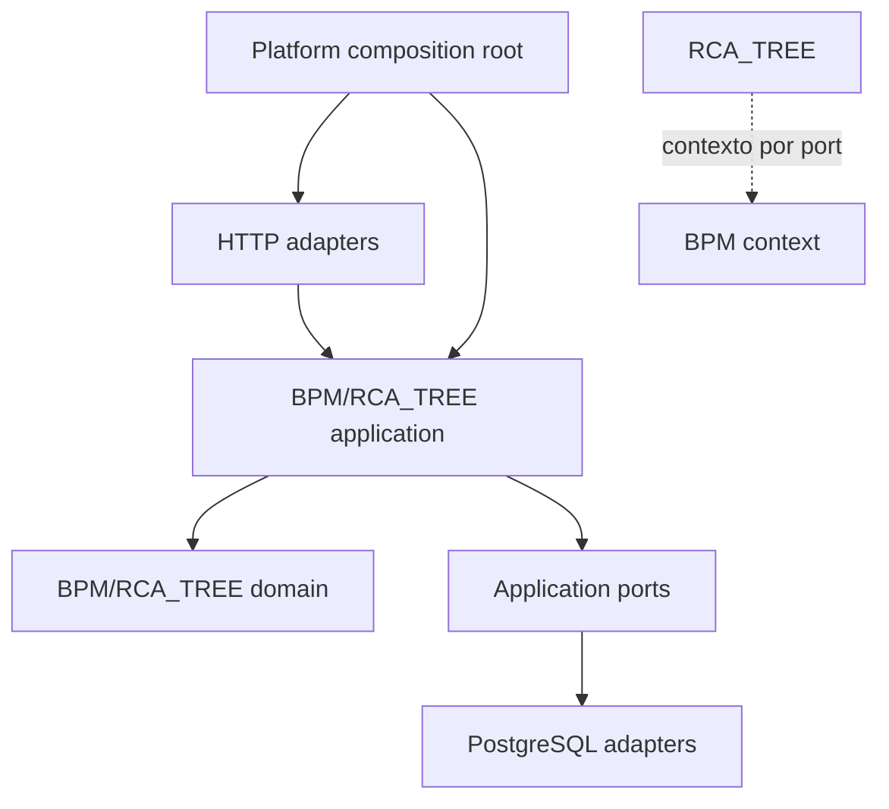

# Auditoría arquitectónica de `UC_BIB_Solve`

Fecha de actualización: 2026-08-29
Alcance: backend Python, PostgreSQL, frontend JavaScript y composición runtime.
Estándar: Modular Monolith orientado a dominio, Clean Architecture y arquitectura hexagonal.

Este documento describe el estado actual tras los refactors BPM y RCA_TREE. Los hallazgos históricos se conservan como trazabilidad, pero no se presentan como defectos activos.

## 1. Resumen ejecutivo

La arquitectura actual es funcional y coherente en sus límites principales:

- BPM y RCA_TREE son bounded contexts separados.
- `Process` es la entidad canónica; no se persisten definiciones ni versiones de procesos.
- `Machine` tiene un único propietario canónico.
- `Operation` y `Stage` tienen propietario en `bpm.domain.operations`.
- La identidad estructural de RCA_TREE usa `node_id`; se eliminaron `legacy_table` y `legacy_id` del esquema final.
- La aplicación se compone desde `platform.infrastructure.app_factory` y los casos de uso reciben dependencias explícitas.
- El frontend separa `api`, `core`, `components`, `services` y `views`, y ya no contiene lógica de versiones BPM.

La deuda restante se concentra en fachadas de compatibilidad internas, puertos BPM demasiado amplios y documentación/migraciones históricas que deben sincronizarse con el esquema final.

| Área | Evaluación | Estado |
|---|---:|---|
| Arquitectura modular | 91/100 | Límites BPM/RCA_TREE/Platform claros. |
| Modelado de dominio | 86/100 | Entidades canónicas con invariantes; agregados aún no formalizados completamente. |
| Regla de dependencias | 94/100 | Sin imports cruzados prohibidos en validadores/runtime. |
| Casos de uso | 88/100 | Organizados por capacidad; algunos ports siguen siendo amplios. |
| Persistencia PostgreSQL | 89/100 | Identidad del grafo canónica; cadena histórica de migraciones pendiente. |
| Frontend | 88/100 | Contratos canónicos y sin versiones BPM; algunas vistas concentran coordinación. |

## 2. Evidencia de verificación

```text
python3 -m unittest discover -s tests -p 'test*.py'       -> 20/20 OK
node --test tests/unit/*.test.mjs                         -> 54/54 OK
python3 scripts/audit_application_architecture.py --check --check-backend
python3 -m compileall -q uc_bib_solv
git diff --check
```

Resultado runtime:

```text
frontend routes=18 renderers=18 menu=9
backend endpoints=68 unique (68 declarations)
routes without renderers: none
renderers without routes: none
duplicate backend endpoint definitions: 0
backend runtime routes=68 available=True
backend inbound adapters not observed at runtime: none
backend dynamic imports: 0
backend parse errors: 0
API modules without static consumers: none
```

Los validadores `structure`, `naming`, `dependencies` y `concrete implementations` pasan.

Verificación PostgreSQL completada mediante la configuración real de `.env.local` y `scripts/check_postgres_pm.py`:

```text
postgresql: connected database=solve_ishikawa user=pedro
pm_schema: tables=bpm_process,pm_process_node,pm_process_transition
pm_schema: OK
pm_process_version: absent
node legacy columns: 0
proceso without node_id: 0
contrato without node_id: 0
maquina without node_id: 0
duplicate owner nodes: 0
```

La prueba T9 del esquema ejecuta 4/4 casos correctamente. El esquema versionado y el hash esperado vigente son los de `db_management/schema.sql` y `tests/architecture/test_t9_boundaries.py`.

## 3. Arquitectura actual

```text
uc_bib_solv/
├── modules/
│   ├── bpm/
│   │   ├── domain/{processes,operations,machines,contracts,associations,configurations,shared}
│   │   ├── application/{use_cases,ports,dto}
│   │   ├── adapters/{inbound/http,outbound/postgres}
│   │   └── infrastructure/
│   ├── rca_tree/
│   │   ├── domain/
│   │   ├── application/{use_cases,ports,dto}
│   │   ├── adapters/{inbound/http,outbound/postgres}
│   │   └── infrastructure/
│   └── platform/{application,adapters,infrastructure}
├── architecture_validators/
└── webapp/js/{api,core,components,services,views}
```



## 4. Estado de los bounded contexts

### BPM

```text
Process
 ├── ProcessNode
 │    └── Operation cuando node_type = operation
 └── ProcessTransition

Machine
 ├── MachineType
 └── MachineOperationConfiguration → Operation + Process + Contract

Contract → alcance BPM por bpm_process_id o bpm_node_id
```

Decisiones vigentes:

- `ProcessDefinition` y `ProcessVersion` no forman parte del modelo activo.
- Una modificación actualiza el mismo proceso; no crea histórico.
- `Machine` se define únicamente en `domain/machines/entities.py`.
- `Operation` y `Stage` se definen únicamente en `domain/operations/entities.py`.
- Los validadores de payload son barrera de forma; las entidades aplican invariantes y producen payload normalizado.
- `MachineOperationConfiguration` normaliza listas, valida estado y expone cambios de estado propios.

### RCA_TREE

- El grafo utiliza `node_id` como identidad estructural.
- Contrato, proceso, máquina, causa e hipótesis mantienen ownership mediante `node_id` cuando participan en el grafo.
- Las consultas y sincronizaciones no dependen de `legacy_table`, `legacy_id` ni referencias legacy.
- RCA_TREE recibe contexto BPM mediante ports o referencias, no mediante imports directos al dominio BPM.

### Platform

Platform contiene composición, Flask, configuración, PostgreSQL, transacciones, logging y agent tools. No debe introducir reglas de BPM ni RCA_TREE.

## 5. Hallazgos y resolución

| ID | Estado | Hallazgo original | Resolución actual |
|---|---|---|---|
| ARC-001 | CERRADO | Coexistían `Process` y `ProcessDefinition`. | `Process` es canónico; se eliminó el modelo activo de definición/versionado. |
| ARC-002 | CERRADO | Existían dos clases `Machine`. | Una única `Machine` canónica y wiring actualizado. |
| ARC-003 | CERRADO | Reglas de grafo y errores duplicados. | Reglas estructurales y routing canónicos. |
| ARC-004 | CERRADO | Platform accedía a repositorios BPM concretos. | Se usa `BpmContextPort`/adaptador inyectado. |
| ARC-005 | CERRADO | Port y fachada de process modeling mezclados. | Composición separada del contrato. |
| ARC-006 | PARCIAL | Fachada operacional y ports amplios. | Dependencias explícitas y `narrow()`; falta segregación adicional por capacidad. |
| ARC-007 | PARCIAL | `*_compat` contenía lógica de aplicación. | Capacidades principales migradas; quedan adaptadores compatibles por limpiar. |
| ARC-008 | CERRADO | Duplicidad de endpoints y aliases HTTP. | 68 declaraciones, 68 rutas runtime y cero duplicados. |
| ARC-009 | PARCIAL | Modelo anémico y validación fuera del dominio. | `Process`, `Contract`, `Machine` y `MachineOperationConfiguration` exponen comportamiento; faltan límites formales de agregado. |

## 6. Deuda residual real

### 6.1 Compatibilidad interna

Persisten nombres o adaptadores de compatibilidad, aunque no representan entidades duplicadas ni rutas duplicadas:

- `BpmOperationalService` y `build_bpm_operational_service` en wiring.
- `ExistingBackendGateway` en agent tools.
- Adaptadores RCA_TREE de detalle/formularios compatibles.
- `legacy_contract_id` y `as_legacy_int()` como traducción de IDs operativos en el borde RCA_TREE.

El proyecto está en desarrollo local y no hay consumidores externos adicionales conocidos. El cierre definitivo consiste en migrar referencias internas y retirar estas fachadas, no en añadir nuevos aliases.

### 6.2 Migraciones históricas

El esquema final ya no contiene las columnas legacy de `node`, pero una migración histórica de ownership todavía referencia esas columnas. Debe consolidarse la cadena o documentarse su precondición para impedir su ejecución sobre una base creada desde el esquema final.

### 6.3 Puertos amplios

`BpmOperationalApplication` es válido como compositor, no como agregado ni port de dominio. Su superficie reúne catálogo, procesos, contratos, máquinas y configuraciones. La mejora futura es exponer ports por capacidad.

### 6.4 Agregados BPM

- `Process` debe ser raíz del grafo de nodos y transiciones.
- `Machine` debe gobernar sus atributos permanentes.
- `MachineOperationConfiguration` debe ser entidad contextual independiente con IDs canónicos.
- `Contract` debe gobernar únicamente alcance y ciclo de vida.

No se recomienda introducir eventos de dominio, CQRS o capas adicionales sin un consumidor real.

## 7. PostgreSQL e identidad

Se distinguen correctamente:

- UUID BPM (`bpm_process_id`, `process_id`, `node_id`) como identidad canónica.
- IDs enteros (`proceso.id`, `contrato.id`, `maquina.id`) solo para relaciones operativas heredadas.

En RCA_TREE:

- `node.node_id` es la identidad estructural.
- `node.legacy_table` y `node.legacy_id` fueron eliminados del esquema final.
- Las relaciones se proyectan por IDs canónicos.
- La sincronización no crea nodos legacy.

Hash de esquema protegido por T9:

```text
18ebe6a415343735869cfd241ed88e6cecd4b2ef391ac8b2a1753c3ecb6b57d2
```

## 8. Frontend

- No contiene lógica de versionado BPM.
- `process_id` en operaciones representa el UUID BPM.
- `operational_process_id` representa explícitamente el ID entero operacional cuando es necesario.
- La cascada proceso → operación → máquina mantiene ambos identificadores separados.
- Las fichas dedicadas gestionan procesos y operaciones.
- El catálogo operacional no ofrece borrado de procesos; esa gestión pertenece al modelado BPM.

La estructura frontend es adecuada. Reducir vistas grandes como `process-modeling.js` y `causa_detalle.js` es una mejora de coste, no un bloqueo.

## 9. Plan de cierre

1. Consolidar o documentar migraciones históricas que referencian columnas eliminadas.
2. Retirar `BpmOperationalService` y `build_bpm_operational_service` tras migrar consumidores internos.
3. Migrar y retirar adaptadores RCA_TREE `*_compat` restantes.
4. Segregar `BpmOperationalApplication` por capacidad.
5. Formalizar comandos/agregados solo para reglas que requieran consistencia entre agregados.
6. Mantener tests Python/JavaScript, validadores, auditoría runtime y T9 como gates.

## 10. Criterio de cierre

La auditoría se cerrará cuando no existan entidades duplicadas, modelos BPM de versiones activos, aliases sin consumidor justificado ni migraciones ambiguas; los ports estén segregados y toda la suite pase sobre PostgreSQL local.

Estado actual: ARC-001 a ARC-005 y ARC-008 cerrados; ARC-006, ARC-007 y ARC-009 abiertos de forma controlada.
