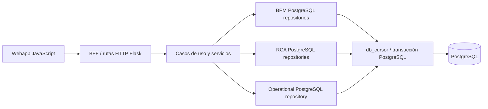
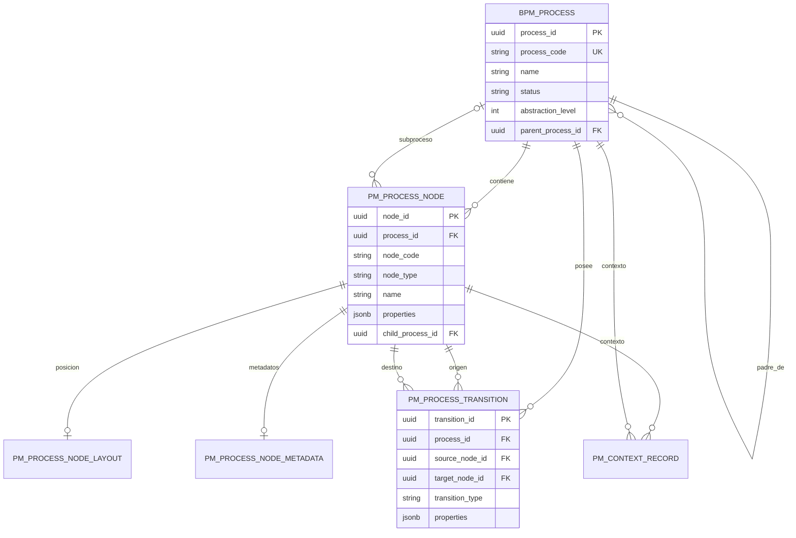
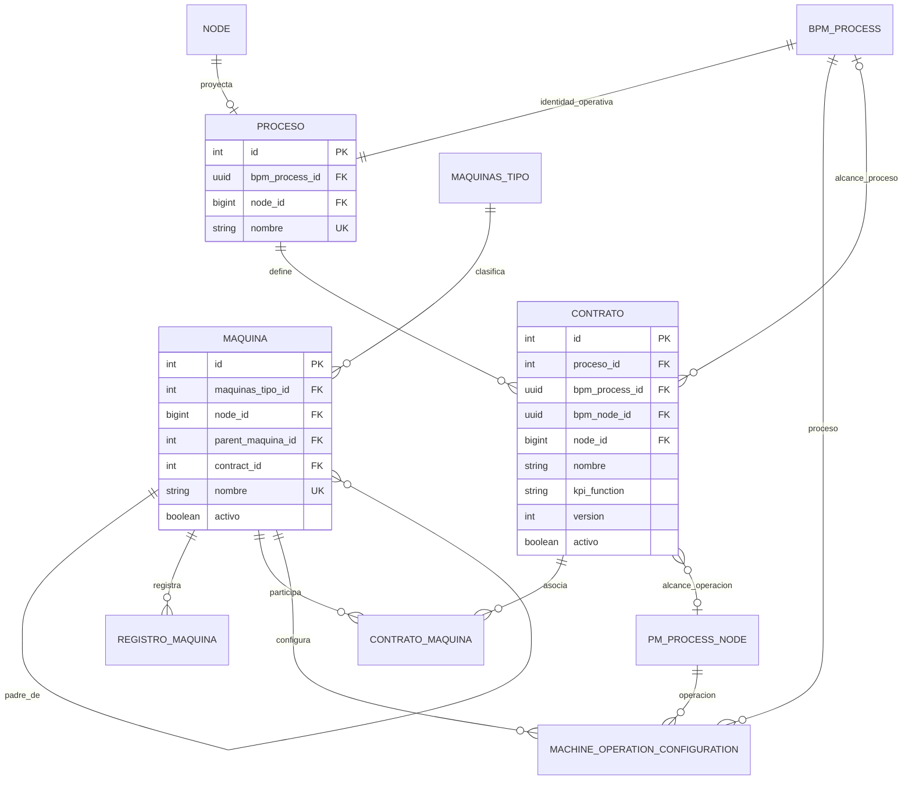
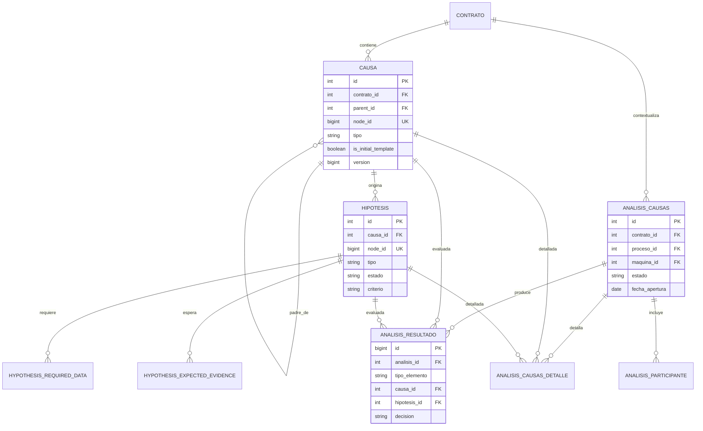
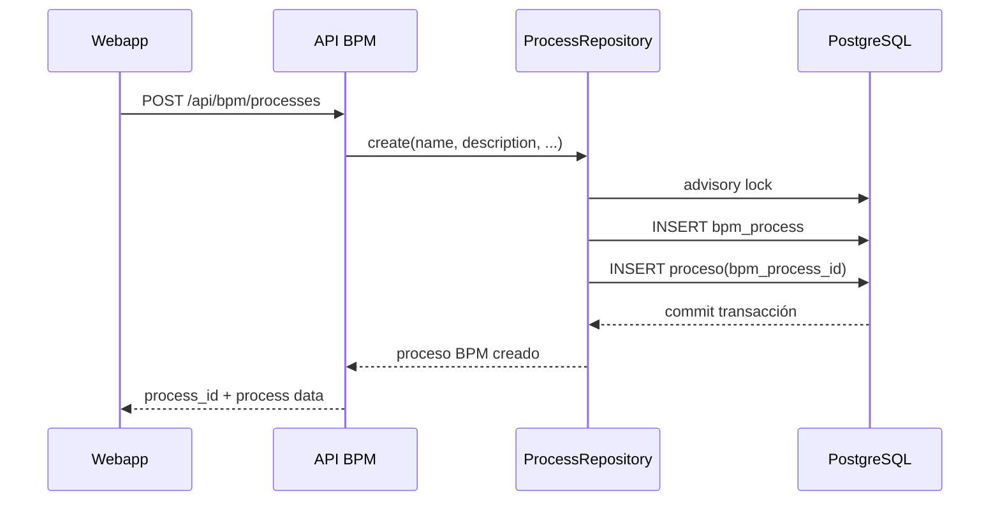
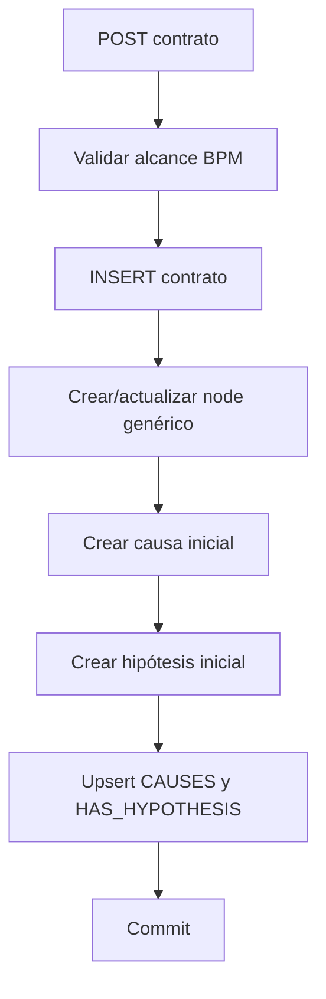
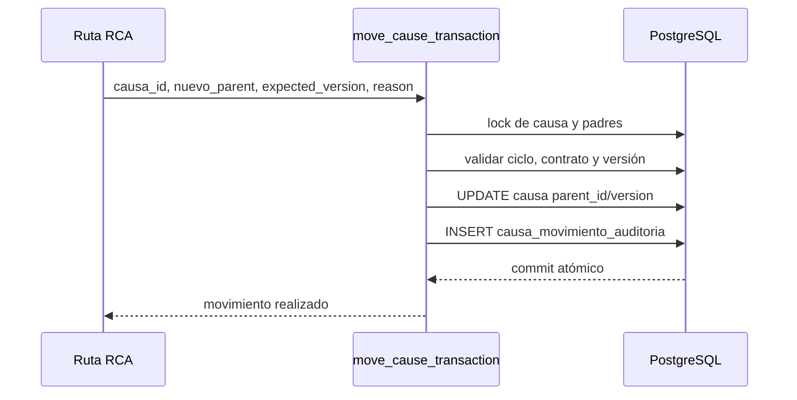

# Informe del modelo de datos PostgreSQL

## 1. Propósito y alcance

Este informe describe el modelo de datos PostgreSQL actualmente presente en el repositorio, sus relaciones, las funcionalidades que soporta y los puntos desde los que se escriben las tablas.

El análisis se ha realizado sobre:

- [`db_management/schema.sql`](../db_management/schema.sql), como definición principal del esquema.
- El despliegue vigente mediante [`db_management/schema.sql`](../db_management/schema.sql) y [`db_management/init_db.py`](../db_management/init_db.py). Las referencias a migraciones o reconciliaciones que aparecen más adelante son contexto histórico de consolidaciones ya absorbidas, no rutas operativas actuales.
- Repositorios PostgreSQL de los módulos BPM y RCA.
- Adaptadores HTTP y clientes JavaScript que exponen las operaciones a la interfaz.
- Cableado de infraestructura y gestión transaccional.

**Fecha del análisis:** 2026-09-13<br>
**Estado:** descripción del estado actual del código; no implica que la base de datos desplegada esté sincronizada con todos los cambios del repositorio.<br>
**Modo de elaboración:** modo degradado autorizado por el programador. La sesión secundaria obligatoria no pudo inicializarse porque el estado local de Codex estaba en modo de solo lectura.

## 2. Resumen ejecutivo

El sistema utiliza dos modelos relacionados:

1. **Modelo BPM canónico**, basado en `bpm_process`, `pm_process_node` y `pm_process_transition`. Es el modelo que representa el proceso como un grafo editable.
2. **Modelo operacional y RCA**, basado en `proceso`, `contrato`, `maquina`, `causa`, `hipotesis` y las tablas de análisis. Este modelo conserva el significado operativo, contractual y de análisis de causa raíz.

La tabla `proceso` enlaza ambos modelos mediante `proceso.bpm_process_id -> bpm_process.process_id`. Por tanto, no debe confundirse el identificador entero de `proceso.id` con el UUID del BPM.

Las operaciones industriales no tienen una tabla `operacion` independiente. Una operación es una fila de `pm_process_node` cuyo `node_type` es `operation`. Sus etapas se almacenan dentro de `pm_process_node.properties->'etapas'`.

Existe además una proyección genérica de grafo formada por `node` y `relationship`. Las entidades de proceso, máquina, contrato, causa e hipótesis pueden tener un `node_id` que las proyecta a ese grafo. Esta proyección no sustituye al modelo BPM canónico: ambos modelos coexisten y cumplen responsabilidades diferentes.

Las escrituras de runtime se realizan principalmente mediante repositorios que usan `db_cursor()` en [`uc_bib_solv/modules/platform/infrastructure/postgres.py`](../uc_bib_solv/modules/platform/infrastructure/postgres.py). Cada uso abre una conexión PostgreSQL y, mediante el context manager de la conexión, confirma la transacción si termina correctamente o la revierte si se produce una excepción.

No se ha encontrado en el esquema actual una tabla de sincronización con Oracle ni tablas de usuarios/autorización. La evidencia disponible permite afirmar que PostgreSQL es el almacenamiento de estas funcionalidades; no permite afirmar que exista una sincronización externa activa.

## 3. Arquitectura de persistencia



### 3.1 Punto de entrada de PostgreSQL

El adaptador común de [`postgres.py`](../uc_bib_solv/modules/platform/infrastructure/postgres.py) concentra:

- creación de conexiones con `DB_CONFIG`;
- cursor `RealDictCursor`;
- apertura y cierre de conexión;
- commit implícito al salir correctamente del contexto;
- rollback implícito cuando la conexión sale por una excepción.

Los repositorios no escriben mediante un ORM identificado en el código inspeccionado: usan SQL parametrizado con `psycopg2`.

### 3.2 Cableado funcional

- El módulo BPM conecta el adaptador PostgreSQL con `ProcessRepository`, `NodeRepository`, `TransitionRepository`, `ProcessLayoutRepository` y los repositorios operacionales.
- El módulo RCA conecta el árbol con repositorios de causas, hipótesis, nodos y relaciones.
- El análisis RCA usa un adaptador PostgreSQL y un adaptador transaccional para guardar participantes, resultados, detalles y movimientos de causas.

## 4. Modelo relacional completo

### 4.1 Inventario de tablas

| Tabla | Responsabilidad | Clave primaria | Relaciones principales | Escritores principales |
|---|---|---|---|---|
| `node` | Proyección genérica de entidades del grafo | `id BIGSERIAL` | Referenciada por `proceso`, `maquina`, `contrato`, `causa`, `hipotesis`, y por `relationship` | `rca_tree/node_repo.py`, `contrato_repo.py`, `graph_sync.py`, `ProcessRepository` |
| `relationship` | Aristas genéricas entre nodos | `id BIGSERIAL` | `parent_node_id`, `child_node_id -> node` | `rca_tree/relationship_repo.py`, `graph_sync.py`, `contrato_repo.py` |
| `proceso` | Compatibilidad/identidad operacional del proceso | `id SERIAL` | `bpm_process_id -> bpm_process`; `node_id -> node` | `pm_process_repo.py`; escrituras directas legacy bloqueadas |
| `bpm_process` | Proceso BPM canónico | `process_id UUID` | `parent_process_id` autorreferenciada; referencia desde `proceso`, `pm_process_node`, `pm_process_transition` | `bpm/pm_process_repo.py` |
| `pm_process_node` | Nodos BPM, incluidas operaciones | `node_id UUID` | `process_id -> bpm_process`; `child_process_id -> bpm_process` para subprocesos | `bpm/pm_process_repo.py`, `operational_repository.py`, fixtures |
| `pm_process_transition` | Transiciones del grafo BPM | `transition_id UUID` | Proceso, nodo origen y nodo destino | `bpm/pm_process_repo.py` |
| `pm_process_node_layout` | Coordenadas editables de nodos BPM | `node_id UUID` | `node_id -> pm_process_node` | `pm_layout_repo.py` |
| `pm_process_node_metadata` | Metadatos editables de un nodo BPM | `metadata_id UUID` | `node_id -> pm_process_node` único | `pm_process_repo.py` |
| `pm_context_record` | Declaraciones, hechos y evidencias de contexto | `record_id UUID` | Propietario opcional por proceso o nodo BPM | `pm_process_repo.py`, fixtures |
| `maquinas_tipo` | Catálogo de tipos de máquina | `id SERIAL` | Referenciada por `maquina` | `operational_repository.py` |
| `maquina` | Instancia física/operativa de máquina | `id SERIAL` | Tipo, nodo genérico, máquina padre y contrato opcional | `maquina_repo.py`, `operational_repository.py` |
| `registro_maquina` | Registros identificables de una máquina | `id SERIAL` | `maquina_id -> maquina` | No se ha confirmado un escritor runtime activo |
| `contrato` | Alcance contractual y KPI | `id SERIAL` | Proceso, BPM process/node, nodo genérico | `contrato_repo.py`, `operational_repository.py` |
| `contrato_maquina` | Asociación contrato-máquina | `(contrato_id, maquina_id)` | Ambos lados con `ON DELETE CASCADE` | `contrato_repo.py`, `operational_repository.py` |
| `machine_operation_configuration` | Configuración máquina-operación-proceso | `id BIGSERIAL` | Máquina, operación BPM, proceso BPM, contrato opcional | `machine_model_repo.py`, `operational_repository.py`, fixtures |
| `causa` | Causa del árbol RCA | `id SERIAL` | Contrato, nodo genérico y causa padre | `causa_repo.py`, `causas_repository.py`, `graph_sync.py` |
| `hipotesis` | Hipótesis asociada a una causa | `id SERIAL` | Causa y nodo genérico | `hipotesis_repo.py`, `graph_sync.py` |
| `hypothesis_required_data` | Datos requeridos por una hipótesis | `id BIGSERIAL` | Hipótesis por `hypothesis_node_id` | `hipotesis_repo.py` |
| `hypothesis_expected_evidence` | Evidencias esperadas por una hipótesis | `id BIGSERIAL` | Hipótesis por `hypothesis_node_id` | `hipotesis_repo.py` |
| `analisis_causas` | Instancia de análisis RCA | `id SERIAL` | Contrato y, opcionalmente, proceso/máquina | `analysis_postgres.py` |
| `analisis_participante` | Participantes de un análisis | `(analisis_id, participante)` | Análisis RCA | `analysis_postgres.py` |
| `analisis_resultado` | Resultado de evaluar causa o hipótesis | `id BIGSERIAL` | Análisis, causa o hipótesis | `analysis_postgres.py`, `analysis_wiring.py` |
| `analisis_causas_detalle` | Detalle/evaluación de elemento del análisis | `id SERIAL` | Análisis, causa/hipótesis y nodo opcional | `analysis_postgres.py` |
| `causa_movimiento_auditoria` | Auditoría de reparenting de causas | `audit_id UUID` | Contrato, causa y padres anterior/nuevo | `transaction_postgres.py` |

### 4.2 Modelo BPM canónico



Tipos de nodo BPM admitidos por el esquema: `input`, `output`, `operation`, `subprocess`, `decision` y `stock`.

Restricciones relevantes:

- `node_code` es único dentro de un proceso.
- Un `subprocess` debe tener `child_process_id` y un nodo que no sea `subprocess` no puede tenerlo.
- Los nodos `stock` deben cumplir las reglas de inventario definidas en los checks del esquema.
- Las transiciones no permiten autoenlaces y son únicas por proceso, origen, destino y tipo.
- La pertenencia de origen y destino al mismo proceso se valida principalmente en la capa de aplicación; no se observa un check equivalente en la tabla de transición.

### 4.3 Modelo operacional y contractual



Un contrato tiene dos formas mutuamente excluyentes de alcance BPM:

- `contrato.bpm_process_id`: el contrato afecta al proceso completo;
- `contrato.bpm_node_id`: el contrato afecta a una operación concreta.

El check y el trigger `validate_contrato_bpm_scope()` verifican que exista exactamente una de las dos referencias, que el nodo sea una operación cuando corresponda y que el proceso canónico relacionado coincida.

### 4.4 Modelo RCA



La tabla `causa` implementa un árbol mediante `parent_id`. La hipótesis es hija de una causa por `hipotesis.causa_id`. Las tablas de resultados y detalles usan una identidad polimórfica: cada fila debe apuntar a una causa o a una hipótesis, pero no a ambas.

## 5. Límites de identidad que deben mantenerse separados

| Identificador | Tipo | Significado | No confundir con |
|---|---|---|---|
| `proceso.id` | `SERIAL` | Identidad operacional histórica/canónica usada por contratos | `bpm_process.process_id` |
| `proceso.bpm_process_id` | `UUID` | Puente desde el proceso operacional al proceso BPM | `proceso.id` |
| `bpm_process.process_id` | `UUID` | Identidad del proceso BPM | `proceso.id` |
| `pm_process_node.node_id` | `UUID` | Identidad de un nodo BPM | `node.id` |
| `node.id` | `BIGSERIAL` | Identidad de la proyección genérica de grafo | `pm_process_node.node_id` |
| `contrato.bpm_node_id` | `UUID` | Alcance de contrato sobre una operación BPM | `contrato.node_id` |
| `contrato.node_id` | `BIGINT` | Nodo genérico asociado al contrato | `contrato.bpm_node_id` |
| `causa.id` / `hipotesis.id` | `SERIAL` | Identidad de dominio RCA | Sus `node_id` genéricos |

En el frontend, el UUID BPM se transporta habitualmente como `bpmProcessId`, mientras que el identificador operacional `process.id` sigue siendo un valor distinto. Las operaciones de selección de proceso deben conservar esta separación.

## 6. Funcionalidades y tablas implicadas

| Funcionalidad | Entrada principal | Tablas leídas/escritas |
|---|---|---|
| Crear proceso BPM | `POST /api/bpm/processes` | Escribe `bpm_process` y `proceso`; crea identidad de proceso y puente operacional |
| Editar proceso BPM | `PATCH /api/bpm/processes/<id>` | Actualiza `bpm_process` y, si cambia el nombre, `proceso` |
| Eliminar proceso BPM | `DELETE /api/bpm/processes/<id>` | Puede eliminar configuraciones, resultados y contratos explícitamente; las FK completan cascadas o bloquean por `RESTRICT` |
| Crear/editar nodos | endpoints `/nodes` | Escribe `pm_process_node`; ciertos nodos también se proyectan a `node` en el modelo RCA/operacional |
| Insertar operación en una transición | endpoint de inserción | Inserta nodo, elimina transición anterior y crea dos transiciones en una transacción |
| Eliminar operación y reconectar | endpoint de operación-delete | Elimina nodo y crea transición de reconexión |
| Editar transiciones | `/transitions` | Escribe `pm_process_transition` |
| Editar layout | `/layout` | Reemplaza/upserta `pm_process_node_layout` |
| Editar metadatos de nodo | `/metadata` | Upsert en `pm_process_node_metadata` |
| Gestionar etapas de operación | `/operation-stages` | Actualiza `pm_process_node.properties->'etapas'` |
| Registrar contexto | `/context-records` | Inserta `pm_context_record` |
| Gestionar contratos | `/contracts` | Escribe `contrato`; crea o actualiza plantillas iniciales de causa/hipótesis y relaciones genéricas |
| Asociar máquinas a contrato | `/contracts/<id>/machines` | Escribe `contrato_maquina` |
| Crear/editar máquinas | `/machines` | Escribe `maquina`; los tipos se mantienen en `maquinas_tipo` |
| Configurar máquinas por operación | `/operation-machines` y configuración | Escribe `machine_operation_configuration` |
| Gestionar causas | rutas RCA de causa | Escribe `node`, `causa` y `relationship`; mantiene el árbol |
| Mover una causa | `PATCH` de parent/move | Actualiza `causa.parent_id` y `causa.version`; inserta `causa_movimiento_auditoria` |
| Gestionar hipótesis | rutas RCA de hipótesis | Escribe `node`, `hipotesis`, datos requeridos, evidencias y relaciones |
| Abrir/cerrar análisis RCA | rutas de análisis | Escribe `analisis_causas`, participantes y resultados |
| Evaluar resultado/detalle | rutas de análisis | Escribe `analisis_resultado` y `analisis_causas_detalle` |
| Validar proceso/KPI | endpoint de validación | Lee el modelo BPM, contratos, máquinas y configuración para validar consistencia |

## 7. Desde dónde se escriben las tablas

### 7.1 Escritura de procesos, nodos y transiciones BPM

El principal punto de escritura es [`pm_process_repo.py`](../uc_bib_solv/modules/bpm/adapters/outbound/postgres/pm_process_repo.py):

- `ProcessRepository.create()` inserta `bpm_process` y después `proceso`.
- Antes de insertar, adquiere el advisory lock `bpm_process_code_generation` y calcula el siguiente código.
- `ProcessRepository.update()` actualiza el proceso BPM y sincroniza el nombre operacional.
- `ProcessRepository.delete()` ejecuta las limpiezas explícitas requeridas para el borrado en cascada funcional y elimina `bpm_process`.
- `NodeRepository.create()` y `create_with_transition()` insertan nodos BPM y, opcionalmente, transiciones.
- `NodeRepository.update()` actualiza nombre, descripción, tipo y propiedades del nodo.
- `NodeRepository.update_stages()` modifica el fragmento `etapas` del JSON `properties`.
- `NodeRepository.insert_operation_on_transition()` sustituye una transición por dos nuevas transiciones.
- `NodeRepository.delete_with_reconnect()` elimina una operación y crea una arista de reconexión.
- `TransitionRepository` crea, actualiza y elimina transiciones.

`proceso_repo.py` no es actualmente la vía de creación: su método de alta rechaza la operación indicando que los procesos deben crearse desde el modelado BPM. Sus métodos restantes son principalmente de lectura o compatibilidad.

### 7.2 Escritura del layout

[`pm_layout_repo.py`](../uc_bib_solv/modules/bpm/adapters/outbound/postgres/pm_layout_repo.py) implementa el reemplazo del layout:

1. Verifica que los nodos recibidos pertenezcan al proceso.
2. Elimina coordenadas que ya no estén presentes.
3. Inserta o actualiza las posiciones solicitadas.
4. Devuelve el layout vigente.

La ausencia de una fila de layout no es un error: el esquema prevé que la aplicación pueda calcular una posición determinista por defecto.

### 7.3 Escritura de contratos y sus plantillas RCA

[`contrato_repo.py`](../uc_bib_solv/modules/bpm/adapters/outbound/postgres/contrato_repo.py) es la vía principal para contratos:

- inserta/actualiza `contrato`;
- valida nombre, KPI y alcance BPM;
- crea o actualiza el nodo genérico del contrato;
- crea las plantillas iniciales de `causa` e `hipotesis`;
- mantiene las relaciones `CAUSES` y `HAS_HYPOTHESIS`.

El borrado del contrato:

- bloquea el contrato;
- identifica causas e hipótesis propias;
- desvincula padres de causas;
- elimina resultados de análisis asociados;
- elimina el contrato;
- limpia los nodos genéricos que el contrato era propietario.

La misma funcionalidad también está expuesta desde `operational_repository.py`, que centraliza la vista operacional y las validaciones de alcance. Conviene tratar `contrato_repo.py` y `operational_repository.py` como dos fachadas del mismo almacenamiento, no como dos modelos de datos independientes.

### 7.4 Escritura de máquinas y configuraciones

[`maquina_repo.py`](../uc_bib_solv/modules/bpm/adapters/outbound/postgres/maquina_repo.py) escribe las instancias de `maquina`, incluyendo los campos JSONB específicos.

`operational_repository.py` concentra las operaciones de catálogo:

- `create_machine()` y `update_machine()` escriben `maquina`;
- `_save_machine_type()` mantiene `maquinas_tipo`;
- `delete_machine()` elimina una máquina, quedando las dependencias sujetas a las FK;
- `save_contract_machines()` mantiene `contrato_maquina`;
- `replace_operation_machines()` reemplaza las asociaciones de una operación;
- `_save_operation_stages()` actualiza las etapas en `pm_process_node.properties`.

[`machine_model_repo.py`](../uc_bib_solv/modules/bpm/adapters/outbound/postgres/machine_model_repo.py) crea configuraciones en `machine_operation_configuration`. El trigger de la tabla verifica que la operación exista, que sea de tipo `operation` y que pertenezca al proceso indicado.

### 7.5 Escritura de la proyección genérica del grafo

[`graph_sync.py`](../uc_bib_solv/modules/rca_tree/adapters/outbound/postgres/graph_sync.py) sincroniza entidades de dominio con `node` y `relationship`. El patrón general es:

1. crear o localizar un nodo genérico;
2. guardar su `node_id` en la entidad de dominio;
3. borrar o reemplazar las relaciones estructurales que gestiona esa entidad;
4. insertar las aristas actuales.

El repositorio RCA de nodos ([`node_repo.py`](../uc_bib_solv/modules/rca_tree/adapters/outbound/postgres/node_repo.py)) también puede crear, actualizar y eliminar filas en `node`. El repositorio de relaciones ([`relationship_repo.py`](../uc_bib_solv/modules/rca_tree/adapters/outbound/postgres/relationship_repo.py)) hace upsert de relaciones y elimina enlaces estructurales.

### 7.6 Escritura de causas e hipótesis

[`causa_repo.py`](../uc_bib_solv/modules/rca_tree/adapters/outbound/postgres/causa_repo.py) crea una causa dentro de una transacción lógica que incluye:

- nodo genérico;
- fila de `causa`;
- relación estructural.

También actualiza la entidad y sus relaciones, mueve causas y aplica protecciones para no eliminar la causa raíz o las plantillas iniciales.

[`hipotesis_repo.py`](../uc_bib_solv/modules/rca_tree/adapters/outbound/postgres/hipotesis_repo.py) mantiene:

- `node`;
- `hipotesis`;
- `hypothesis_required_data`;
- `hypothesis_expected_evidence`;
- relaciones genéricas.

Las colecciones de datos y evidencias se reemplazan normalmente mediante borrado e inserción de posiciones.

### 7.7 Escritura de análisis RCA

[`analysis_postgres.py`](../uc_bib_solv/modules/rca_tree/adapters/outbound/postgres/analysis_postgres.py) escribe:

- `analisis_causas` al abrir un análisis;
- `analisis_participante` al registrar participantes;
- `analisis_resultado` al guardar evaluaciones;
- `analisis_causas_detalle` al guardar el detalle de evaluación.

El adaptador comprueba que el elemento evaluado pertenece al contrato del análisis y que el análisis está abierto cuando la operación exige modificar contenido. `analysis_wiring.py` añade la integración con la persistencia científica y los campos de decisión, justificación y control.

### 7.8 Escritura atómica de movimientos de causas

[`transaction_postgres.py`](../uc_bib_solv/modules/rca_tree/adapters/outbound/postgres/transaction_postgres.py) implementa el movimiento de causas con:

- bloqueo de filas relevantes;
- comprobación de ciclos;
- comprobación de contrato;
- control optimista por `causa.version`;
- actualización de `parent_id` y versión;
- inserción en `causa_movimiento_auditoria`.

La propia base de datos impide modificar o borrar la auditoría mediante un trigger append-only.

## 8. Matriz de escrituras por tabla

| Tabla | Escritura runtime confirmada | Escrituras no runtime |
|---|---|---|
| `bpm_process` | Crear/editar/borrar desde `ProcessRepository` | `schema.sql`, fixtures, scripts de mantenimiento |
| `proceso` | Alta y sincronización de nombre desde `ProcessRepository` | Migraciones/backfills; alta legacy bloqueada |
| `pm_process_node` | Crear/editar/borrar desde `NodeRepository`; etapas desde `operational_repository` | Seeds y limpieza E2E |
| `pm_process_transition` | `TransitionRepository` y operaciones de inserción/reconexión | Seeds y limpieza E2E |
| `pm_process_node_layout` | `ProcessLayoutRepository` | Migración de layout |
| `pm_process_node_metadata` | Upsert del repositorio BPM | Seed de metadata |
| `pm_context_record` | Endpoint de contexto y repositorio BPM | Fixtures |
| `node` | Repositorios RCA, contratos y sincronización de grafo | Backfills/migraciones |
| `relationship` | Repositorios RCA, contratos y `graph_sync` | Migraciones de relaciones y fixtures |
| `contrato` | Repositorios de contrato/operacional | Migraciones y fixtures |
| `contrato_maquina` | Asociación de contratos y máquinas | Fixtures |
| `maquinas_tipo` | Catálogo operacional | Schema/fixtures |
| `maquina` | Repositorios de máquina/operacional | Fixtures y mantenimiento |
| `registro_maquina` | No confirmado en runtime | Definición de esquema y posibles scripts legacy |
| `machine_operation_configuration` | Repositorios de configuración y reemplazo operacional | Fixtures, migraciones y limpieza E2E |
| `causa` | Repositorio de causas, sincronización de grafo y reparenting | Migraciones de versionado |
| `hipotesis` | Repositorio de hipótesis | Migraciones y fixtures |
| `hypothesis_required_data` | Repositorio de hipótesis | Fixtures |
| `hypothesis_expected_evidence` | Repositorio de hipótesis | Fixtures |
| `analisis_causas` | Adaptador de análisis | Migraciones y limpieza de fixtures |
| `analisis_participante` | Adaptador de análisis | Fixtures |
| `analisis_resultado` | Adaptadores de análisis | Limpieza E2E y migraciones |
| `analisis_causas_detalle` | Adaptador de análisis | Fixtures |
| `causa_movimiento_auditoria` | Transacción de movimiento de causa | DDL de esquema/migración |

## 9. API HTTP que origina las escrituras

### BPM y operación

Las rutas principales están en [`process_modeling.py`](../uc_bib_solv/modules/bpm/adapters/inbound/http/process_modeling.py):

```text
GET/POST       /api/bpm/processes
GET/PATCH/DELETE /api/bpm/processes/<process_id>
GET/PUT        /api/bpm/processes/<process_id>/layout
POST/PATCH/DELETE .../nodes
POST           .../nodes-with-transition
POST           .../insert-operation
POST           .../operation-delete
GET/PATCH      .../metadata
GET/PATCH      .../operation-stages
PUT            .../operation-machines
GET/POST/PATCH/DELETE .../transitions
GET/POST       .../context-records
POST           .../validate
GET/POST/PATCH/DELETE .../contracts
GET/PUT        .../contracts/<id>/machines
GET/POST/PATCH/DELETE .../machines
```

Los clientes [`process-modeling.js`](../uc_bib_solv/webapp/js/api/process-modeling.js) y [`operational.js`](../uc_bib_solv/webapp/js/api/operational.js) traducen las acciones de la interfaz a estas rutas.

### RCA y análisis

Las rutas están en [`rca_tree/adapters/inbound/http/routes.py`](../uc_bib_solv/modules/rca_tree/adapters/inbound/http/routes.py):

```text
GET              árbol, detalle, causa e hipótesis
POST/PATCH/DELETE causas
PATCH            movimiento de padre de causa
POST/PATCH/DELETE hipótesis
GET/POST          análisis y plantillas
GET/PATCH         análisis concreto
POST              resultados de análisis
```

Los clientes [`causas.js`](../uc_bib_solv/webapp/js/api/causas.js) y [`analysis.js`](../uc_bib_solv/webapp/js/api/analysis.js) son los consumidores de estas rutas desde la interfaz.

## 10. JSONB y datos semiestructurados

| Tabla/campo | Contenido |
|---|---|
| `node.metadata` | Metadatos de una proyección genérica |
| `relationship.metadata` | Datos de una arista genérica |
| `pm_process_node.properties` | Propiedades por tipo de nodo; en operaciones contiene `etapas`; en stock, datos de inventario |
| `maquinas_tipo.nominal_capacity` | Capacidad nominal como objeto JSON |
| `maquinas_tipo.elements_zones_positions` | Elementos, zonas y posiciones como array |
| `maquinas_tipo.control_systems` | Sistemas de control como array |
| `maquinas_tipo.common_technical_characteristics` y `common_limitations` | Características y limitaciones comunes |
| `maquina.specific_*` | Descripción, parámetros, rangos, limitaciones, instrucciones y diferencias de una máquina concreta |
| `machine_operation_configuration.*` | Entradas, controles, mediciones y reglas de seguridad de la relación máquina-operación |
| `pm_process_node_metadata.metadata` | Metadatos propios del nodo BPM |
| `pm_context_record.payload`, `source`, `provenance`, `supports` | Contexto, procedencia y evidencias de proceso/nodo |

El esquema aplica checks de forma para algunos JSONB, por ejemplo objeto frente a array. No impone un esquema semántico completo para todos los campos; la validación detallada reside en servicios y repositorios.

## 11. Integridad referencial, borrado y versionado

### 11.1 Patrones de `ON DELETE`

- `CASCADE` se usa en dependencias propiedad del padre: nodos BPM de un proceso, transiciones, layout, metadatos, contexto, hipótesis de una causa, análisis de un contrato y asociaciones contrato-máquina.
- `RESTRICT` protege referencias que deben resolverse explícitamente: tipos de máquina, algunos nodos operativos, subprocesos, contratos y elementos usados por resultados.
- `SET NULL` conserva la fila dependiente cuando la referencia es contextual u opcional, por ejemplo ciertos vínculos de proceso/máquina o la referencia a un padre anterior en auditoría.

### 11.2 Protecciones de aplicación y base de datos

- La causa raíz y las plantillas iniciales no se pueden eliminar mediante las rutas normales.
- El borrado de causa comprueba referencias estructurales y de análisis antes de eliminar.
- El movimiento de causa se controla con bloqueo, detección de ciclos y versión.
- `causa_movimiento_auditoria` es append-only por trigger.
- El alcance del contrato tiene checks y trigger de consistencia BPM.
- La configuración máquina-operación tiene trigger para comprobar tipo de nodo y proceso.

### 11.3 Versionado

- `causa.version` es el control de concurrencia del árbol RCA y se incrementa al mover una causa.
- `contrato.version` es un campo de versión contractual, pero no se ha confirmado en los escritores runtime revisados un incremento automático en cada edición.
- No se observa una tabla `pm_process_version` en el modelo canónico actual. La mención al antiguo script de reconciliación `scripts/migrate_current_schema.sql` se conserva sólo como contexto histórico; no forma parte del despliegue vigente ni debe ejecutarse.

## 12. DDL y scripts históricos

La única vía vigente de despliegue del esquema es `db_management/init_db.py`,
que ejecuta `db_management/schema.sql` en una transacción. La tabla siguiente
conserva la trazabilidad histórica de artefactos que participaron en trabajos
anteriores; no deben ejecutarse ni recrearse como migraciones incrementales.

| Ruta | Tipo | Efecto |
|---|---|---|
| `db_management/schema.sql` | DDL y seed estructural | Crea tablas, índices, checks, triggers y funciones |
| `db_management/init_db.py` | Inicialización | Ejecuta el esquema inicial y confirma la transacción |

Los fixtures y scripts de mantenimiento no deben confundirse con una ruta de negocio usada por la UI.

## 13. Flujos de escritura principales

### 13.1 Alta de un proceso BPM



El código de proceso se calcula en el repositorio después de adquirir el advisory lock. La escritura final queda dentro de la transacción PostgreSQL; no se ha encontrado una secuencia o trigger de base de datos que genere por sí mismo `process_code`.

### 13.2 Alta de contrato con plantilla RCA



### 13.3 Movimiento de causa



## 14. Hallazgos y riesgos técnicos

### Confirmado

- El BPM canónico se persiste en `bpm_process`, `pm_process_node` y `pm_process_transition`.
- `proceso` es el puente operacional hacia el BPM.
- Las operaciones son nodos BPM, no filas de una tabla `operacion`.
- Las escrituras runtime pasan por repositorios PostgreSQL y `db_cursor()`.
- El árbol RCA se apoya en tablas propias y en una proyección genérica `node`/`relationship`.
- El movimiento de causas dispone de control de concurrencia y auditoría append-only.

### Parcial o sujeto a verificación del entorno

- `schema.sql` contiene la evolución acumulada del modelo y `init_db.py` es la única vía soportada para desplegarlo. Para conocer el estado real hay que comparar el esquema instalado con `pg_catalog`; no se deben ejecutar migraciones históricas para compensar diferencias.
- Algunas validaciones de pertenencia y alcance se realizan en aplicación, por lo que no todas las invariantes están protegidas directamente por FK o check.
- `contrato.version` existe en el modelo, pero la política de incremento automático no queda confirmada por los escritores revisados.
- El código acepta más campos científicos de hipótesis de los que necesariamente actualiza cada sentencia SQL; conviene probar cada campo con una actualización de integración.

### Riesgos de mantenimiento

- La coexistencia de modelo BPM, modelo operacional y proyección genérica facilita la compatibilidad, pero aumenta el riesgo de desincronización entre identificadores y relaciones.
- Hay migraciones y fixtures con escrituras directas. En producción deben ejecutarse con una política separada de las rutas runtime.
- La flexibilidad JSONB permite evolucionar el modelo, pero dificulta conocer el contrato semántico sin revisar validadores y consumidores.
- El borrado depende de una combinación de código explícito y acciones referenciales. Un cambio de FK puede alterar el comportamiento de eliminación.
- El estado del worktree contiene cambios no relacionados; las referencias de línea de este informe corresponden al estado analizado y pueden desplazarse.

## 15. Consultas de verificación recomendadas

Para comprobar el estado real de una instalación, ejecutar en modo lectura:

```sql
-- Tablas presentes
SELECT table_schema, table_name
FROM information_schema.tables
WHERE table_schema NOT IN ('pg_catalog', 'information_schema')
ORDER BY table_schema, table_name;

-- Columnas y tipos
SELECT table_name, ordinal_position, column_name, data_type, is_nullable
FROM information_schema.columns
WHERE table_schema = 'public'
ORDER BY table_name, ordinal_position;

-- Claves foráneas y acciones
SELECT tc.table_name,
       kcu.column_name,
       ccu.table_name AS referenced_table,
       ccu.column_name AS referenced_column,
       rc.delete_rule
FROM information_schema.table_constraints tc
JOIN information_schema.key_column_usage kcu
  ON tc.constraint_name = kcu.constraint_name
 AND tc.table_schema = kcu.table_schema
JOIN information_schema.constraint_column_usage ccu
  ON ccu.constraint_name = tc.constraint_name
 AND ccu.table_schema = tc.table_schema
JOIN information_schema.referential_constraints rc
  ON rc.constraint_name = tc.constraint_name
 AND rc.constraint_schema = tc.table_schema
WHERE tc.constraint_type = 'FOREIGN KEY'
  AND tc.table_schema = 'public'
ORDER BY tc.table_name, kcu.column_name;

-- Triggers y funciones de integridad
SELECT event_object_table, trigger_name, action_statement
FROM information_schema.triggers
WHERE event_object_schema = 'public'
ORDER BY event_object_table, trigger_name;
```

Para auditar escritores de aplicación, buscar las sentencias `INSERT`, `UPDATE`, `DELETE` y `ON CONFLICT` en:

```text
uc_bib_solv/modules/bpm/adapters/outbound/postgres/
uc_bib_solv/modules/rca_tree/adapters/outbound/postgres/
db_management/
scripts/
```

## 16. Conclusión operativa

El punto de entrada recomendado para entender cada cambio es:

1. identificar la funcionalidad y su ruta HTTP;
2. localizar el caso de uso y el repositorio PostgreSQL invocado;
3. comprobar las tablas modificadas y sus relaciones;
4. verificar la transacción `db_cursor()` y las restricciones de PostgreSQL;
5. separar runtime, migración, fixture y mantenimiento.

La frontera de persistencia actual puede resumirse así:

```text
UI
  -> rutas HTTP BPM/RCA
    -> casos de uso y servicios
      -> repositorios PostgreSQL
        -> db_cursor() / psycopg2
          -> tablas PostgreSQL, FK, checks y triggers
```

Para cambios futuros, la decisión más importante es mantener explícito qué identificador se está usando: el `id` operacional de `proceso`, el UUID del proceso BPM, el UUID del nodo BPM o el `id` del nodo genérico.
