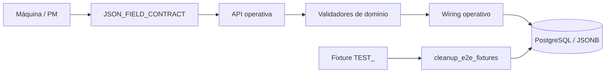

# Requerimiento 16 — persistencia, UX JSON, navegación y limpieza de fixtures

## Objetivo

Documentar el estado operativo de la implementación de Requerimiento 16: edición estructurada de JSON, navegación consistente de Máquina, validación y persistencia operativa, y limpieza acotada de fixtures E2E.

## Audiencia y alcance

- **Mantenedores:** deben conservar el contrato JSON común, la separación de contexto y el wiring operativo descritos aquí.
- **Operadores de pruebas:** deben proporcionar PostgreSQL y una URL E2E antes de ejecutar la suite Playwright.
- **Incluye:** `uc_bib_solv/`, el helper de cleanup, la suite E2E de Requerimiento 16 y su configuración.
- **Excluye:** cambios de esquema; `db_management/schema.sql` no se modifica en este requerimiento.

## Estado actual

La implementación está integrada y documentada como `implementado_pendiente_validacion` en los artefactos SDD. La autorización explícita del programador deja aprobados por defecto los gates de validación del flujo y autoriza el modo degradado de esta fase. Esa decisión administrativa no convierte la cobertura E2E no ejecutada en cobertura pasada: PostgreSQL y una URL/backend E2E no estuvieron disponibles en el entorno.

Capacidades vigentes:

- La edición de Máquina y metadatos PM usa el contrato común de `json-editor.js`.
- `nominal_capacity` se valida como objeto; las listas y los campos objeto-o-lista conservan su forma.
- Contexto y `machine_operation_configuration` permanecen separados del modal principal; Contexto es de solo lectura.
- La navegación usa una matriz común y conserva la selección de Máquina al cambiar de ruta cuando no cambia el alcance.
- El backend valida forma, identidad y estado antes de delegar en persistencia; los errores exponen código y campo cuando procede.
- El cleanup E2E usa allowlist `TEST_`, ownership verificable, orden de dependencias y transacción; no usa `TRUNCATE` ni operaciones globales.

## Estructura y archivos afectados

| Ruta | Responsabilidad | Cuándo modificar |
| --- | --- | --- |
| `uc_bib_solv/webapp/js/components/json-editor.js` | Contrato `JSON_FIELD_CONTRACT`, modelos dirty, validación, serialización y editor guiado/avanzado | Al cambiar campos JSON editables o sus formas permitidas |
| `uc_bib_solv/webapp/js/views/maquinas_v02.js` | Modal y proyección de campos de tipo/máquina | Al cambiar UX, IDs o payload de Máquina |
| `uc_bib_solv/webapp/js/views/process-modeling.js` y `components/process-modeling/` | Edición y presentación de metadatos PM | Al cambiar campos o envelope PM |
| `uc_bib_solv/webapp/js/views/contexto.js` | Presentación de contexto de solo lectura | Solo si cambia el contrato de consulta/presentación |
| `uc_bib_solv/webapp/js/views/shell_v02.js` | Fuente común de menú lateral y superior | Al añadir o retirar rutas autorizadas |
| `uc_bib_solv/webapp/js/core/state.js`, `router.js` | Estado de selección y navegación | Al cambiar reglas de alcance o deep links |
| `uc_bib_solv/modules/operational_modeling/` | Dominio, casos de uso, puertos, adaptador y wiring canónico | Al cambiar validación o coordinación operativa |
| `uc_bib_solv/routes/operational.py`, `uc_bib_solv/repositories/operational_repository.py` | Contrato HTTP y persistencia PostgreSQL/JSONB | Al cambiar endpoints, mapeos o transacciones |
| `scripts/cleanup_e2e_fixtures.py` | Cleanup allowlisted e idempotente | Al cambiar recursos de fixtures o dependencias de borrado |
| `tests/e2e/requerimiento-16.spec.js`, `playwright.config.js` | Casos E2E-16-01…E2E-16-12 y artefactos por ejecución | Al ampliar criterios E2E o el entorno de ejecución |

## Operación principal

1. La vista de Máquina crea modelos a partir de `JSON_FIELD_CONTRACT` y monta controles guiados para objetos/listas; el modo avanzado solo se usa para estructuras abiertas.
2. La modificación se marca `dirty`, se valida localmente y se serializa como valores JSON nativos. El backend vuelve a validar antes de escribir.
3. El wiring `modules/operational_modeling/infrastructure/wiring.py` conecta casos de uso con el adaptador de persistencia operativo. La respuesta del backend se utiliza para rehidratar la UI.
4. Para E2E, los fixtures deben identificarse mediante IDs devueltos por el fixture o prefijos `TEST_`. `cleanup_fixture` resuelve dependencias, borra dentro de una transacción y verifica que no queden nodos del fixture.



## Decisiones vigentes

| ID | Decisión | Racional | Alternativa descartada | Consecuencias | Archivos afectados | Estado |
| --- | --- | --- | --- | --- | --- | --- |
| DEC-16-01 | Mantener un contrato frontend común para JSON | Evita que Máquina y PM interpreten de forma distinta objeto, lista y nulabilidad | Parsers JSON independientes por vista | Los nuevos campos deben registrarse en `JSON_FIELD_CONTRACT` y en backend | `json-editor.js`, vistas Máquina/PM | Vigente |
| DEC-16-02 | `nominal_capacity` solo admite objeto | Coincide con la restricción JSONB y evita payloads de lista inválidos | Aceptar cualquier JSON desde el textarea | El error se muestra antes de una escritura válida y se vuelve a comprobar en dominio | `json-editor.js`, `domain/validators.py` | Vigente |
| DEC-16-03 | Contexto y configuración contextual quedan fuera del modal principal | Son datos de contexto/operación y no deben confundirse con atributos editables de la máquina | Convertir toda respuesta JSON en formulario | Contexto permanece como salida de solo lectura | `contexto.js`, `maquinas_v02.js` | Vigente |
| DEC-16-04 | El menú se deriva de `V02_MENU_ITEMS` | Una sola matriz evita que menú superior y lateral diverjan | Listas locales por vista | Nuevas rutas autorizadas deben añadirse a la matriz común | `shell_v02.js`, `maquinas_v02.js` | Vigente |
| DEC-16-05 | Cleanup acotado por ownership/prefijo y transacción | Protege datos reales y permite repetición segura de fixtures | `reset_db.py`, `TRUNCATE` o borrado por tabla completa | Un target no demostrablemente `TEST_` se rechaza antes de borrar | `cleanup_e2e_fixtures.py`, fixtures/tests | Vigente |
| DEC-16-06 | La evidencia ambiental se conserva como bloqueo, no como éxito | La ausencia de PostgreSQL/URL E2E impide verificar persistencia y UI remotamente | Marcar los casos omitidos como pasados | Los casos E2E quedan implementados pero requieren una ejecución posterior | `tests/e2e/requerimiento-16.spec.js`, `playwright.config.js` | Vigente |

## Configuración y ejecución

| Recurso / variable | Obligatorio | Uso | Valor esperado / fuente |
| --- | --- | --- | --- |
| `UI_TEST_BASE_URL` | Para E2E UI | URL base del backend/webapp de pruebas | URL accesible del entorno E2E |
| `E2E_DASH_BACKEND_URL` | Alternativa para E2E | URL backend cuando no se usa `UI_TEST_BASE_URL` | URL accesible del backend |
| `E2E_ARTIFACTS_DIR` | No | Raíz opcional de artefactos | `.playwright-artifacts/test-results` por defecto |
| PostgreSQL y esquema operativo | Para persistencia/cleanup E2E | Fixture, round-trip JSONB y cleanup | Conexión configurada para el entorno de pruebas |

La suite se ejecuta con Chromium, un worker y artefactos persistentes:

```bash
npx playwright test --config=playwright.config.js tests/e2e/requerimiento-16.spec.js
```

## Evidencia de verificación

| Comprobación | Resultado | Interpretación |
| --- | --- | --- |
| Unitarias Python relevantes | 17 tests OK | Evidencia determinista de dominio/contratos seleccionados |
| Unitarias JavaScript relevantes | 3 suites / 7 subtests OK | Evidencia del contrato frontend seleccionado |
| `compileall` y `node --check` | OK | Sintaxis comprobada para los archivos revisados |
| Suite completa con `pytest` | No ejecutable: `pytest: command not found` | No se declara pasada |
| PostgreSQL | No disponible en el entorno | Persistencia, rollback y cleanup real quedan sin verificación ambiental |
| Playwright E2E-16-01…E2E-16-12 | No pasada; la suite corregida se ejecutó con `UI_TEST_BASE_URL=http://127.0.0.1:8050`, pero Chromium no pudo iniciar por `sandbox_host_linux.cc:41` (`Operation not permitted`) | La suite conserva los 12 casos, pero no hay evidencia de éxito E2E en este runtime |
| `db_management/schema.sql` | Sin cambios | El alcance no incluye DDL |

También existe una referencia histórica/preexistente a la ruta eliminada `app/persistence/machine_model_repo.py` en `tests/unit/test_req12_machine_projection.py`; no se atribuye a Requerimiento 16 ni se presenta como fallo de su implementación.

## Riesgos y troubleshooting

- Antes de ejecutar E2E, comprobar `UI_TEST_BASE_URL`/`E2E_DASH_BACKEND_URL`, disponibilidad de PostgreSQL y permisos del navegador Chromium.
- Revisar `ac-results.json` y los artefactos bajo `.playwright-artifacts/test-results/`; un estado `skipped`, ausencia de URL o error de arranque no equivale a un pass.
- No usar `db_management/reset_db.py` para fixtures E2E. Usar `scripts/cleanup_e2e_fixtures.py` con un prefijo o IDs con ownership demostrado.
- Si se cambia una forma JSON, actualizar conjuntamente el contrato frontend, los validadores de dominio, los tests y esta documentación.

## Relación con artefactos SDD

- Spec: `requeriments_spec_driven_development/requerimiento_16/spec.md`
- Plan: `requeriments_spec_driven_development/requerimiento_16/task_plan.md`
- Documentación de módulo adicional: no se actualiza; el boundary propio del requerimiento es suficiente y la estructura existente no exige duplicar esta información.
- Provenance de esta fase: el `documentation-agent` obligatorio no pudo iniciar por el estado de solo lectura del runtime Codex; el programador autorizó explícitamente modo degradado. Esta documentación fue actualizada bajo esa contingencia, preservando el worktree no relacionado.
