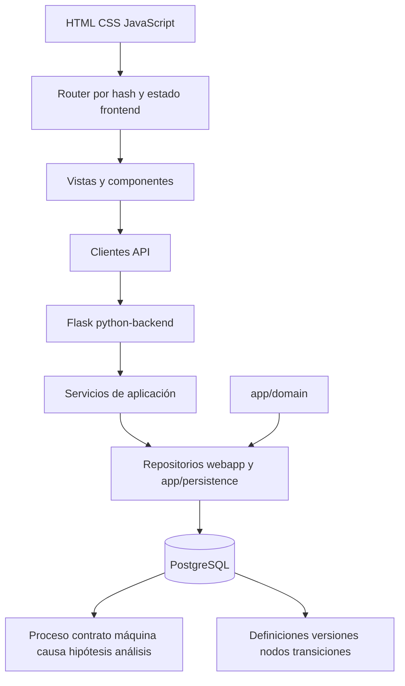

 # Resumen de UC_BIB_Solve — estado de la aplicación en julio de 2026

> Documento generado en modo degradado autorizado por el programador humano porque `documentation-agent` no pudo completar el artefacto. Se ha contrastado el código actual con `README.md`, `context.md`, el esquema PostgreSQL, rutas y servicios Flask, vistas JavaScript, tests, artefactos SDD y el estado registrado en Engram/codebase-memory.

## 1. Propósito de este documento

Este documento resume el estado funcional y técnico de UC_BIB_Solve para que otro ChatGPT pueda evaluar qué fases o requerimientos conviene implementar a continuación. Se distingue entre:

- hechos observables en el código y los artefactos;
- decisiones o estados registrados en el flujo SDD;
- inferencias y preguntas que todavía necesitan confirmación humana.

No es un changelog. Describe la solución que existe hoy, sus límites y las decisiones que deberían tomarse antes de ampliar alcance.

## 2. Objetivo global de la aplicación

UC_BIB_Solve es una aplicación para representar y analizar operaciones industriales mediante dos capacidades relacionadas, pero todavía no completamente integradas:

1. **Modelo operativo y conocimiento causal**: procesos, contratos, máquinas, causas, efectos, hipótesis y sesiones de análisis causa-raíz.
2. **Modelado visual de procesos**: definición versionada de procesos BPM, nodos operativos, decisiones, ramas, stocks y subprocesos expandibles.

El objetivo de producto parece ser proporcionar una base navegable y trazable para pasar de una operación industrial concreta a:

- la representación de cómo se ejecuta el proceso;
- la identificación de causas y efectos asociados;
- la formulación y evaluación de hipótesis;
- la persistencia de evidencias y resultados de análisis;
- la evolución controlada del proceso mediante versiones.

La aplicación está en una fase funcional avanzada de prototipo/vertical slices. Hay bastante comportamiento implementado, pero la validación final humana de varias áreas no está cerrada y el objetivo final de integración entre modelado BPM, operaciones y análisis causal aún debe concretarse.

## 3. Estado ejecutivo

| Área | Estado observado | Observación |
| --- | --- | --- |
| Backend HTTP | Implementado | Flask con blueprints para bootstrap, health, operaciones, causas, análisis y process modeling. |
| Frontend principal actual | Implementado | HTML/CSS/JavaScript estático servido por `webapp_java`; router por hash y vistas modulares. |
| PostgreSQL | Implementado | Esquema idempotente amplio, con modelo causal legado/actual y bounded context de process modeling. |
| Gestión operativa | Implementada | CRUD de procesos, contratos y máquinas; relación contrato-máquina. |
| Árbol causal | Implementado parcialmente/funcional | CRUD, detalle, hipótesis, reutilización y visualización; quedan dudas de proyección entre contratos y del alcance corporativo. |
| Análisis causa-raíz | Implementado | Apertura, listado, detalle y resultados; necesita validación funcional final y definición de flujo completo. |
| Modelado de procesos | Implementado en vertical slice | Versiones, nodos, transiciones, validación, decisiones, stocks y subprocesos inline. |
| Layout BPM | Implementado con correcciones recientes | Hay varias NC registradas; varias correcciones técnicas pasan Playwright, pero Gate 3 humano sigue pendiente. |
| Autenticación/autorización | No evidenciada | Existe un servicio `permissions.js`, pero no se ha confirmado un control de acceso real de extremo a extremo. |
| Despliegue productivo | No evidenciado | La documentación operativa habla de DSS/CI, pero este repositorio no demuestra un flujo productivo cerrado para esta aplicación. |
| Estado SDD | Incompleto | Hay specs, planes y NCs, pero estados antiguos y actuales no siempre están sincronizados. |

## 4. Funcionalidades implementadas

### 4.1 Catálogo operativo

El backend expone un catálogo operativo y páginas de operación mediante `routes/operational.py` y `services/operational_service.py`.

Capacidades observadas:

- listar procesos;
- crear, editar y eliminar procesos;
- listar, crear, editar, activar/desactivar y eliminar contratos;
- asociar contratos con múltiples máquinas;
- consultar y guardar la selección de máquinas de un contrato;
- listar, crear, editar y eliminar máquinas;
- navegar por páginas operativas;
- mantener estados activos/inactivos de contratos y máquinas;
- cargar un catálogo inicial para que las vistas compartan proceso, contrato y máquina seleccionados.

La UI relevante está en `views/procesos_v02.js`, `views/contratos_v02.js`, `views/maquinas_v02.js`, `core/operational.js`, `core/state.js` y `api/operational.js`.

**Objetivo de esta funcionalidad:** establecer el contexto industrial sobre el que se selecciona un proceso, un contrato y una máquina antes de consultar o editar causas, análisis y modelos de proceso.

### 4.2 Base causal y árbol de causas

El módulo causal utiliza causas jerárquicas asociadas a contratos. El backend está repartido entre:

- `routes/causas.py`;
- `services/causas_service.py`;
- `services/causa_detail_service.py`;
- repositorios de causas, hipótesis, nodos y relaciones en `app/persistence/`;
- vistas `arboles_v02.js`, `causa_detalle.js` y `causa_detalle_v02.js`.

Capacidades observadas:

- listar el árbol de un contrato;
- crear causas raíz y causas hijas;
- editar y eliminar causas;
- consultar el detalle de una causa;
- mostrar el padre y el contexto contractual;
- crear, editar y eliminar hipótesis asociadas a causas;
- previsualizar el borrado de hipótesis;
- representar tipos de causa/efecto y estados de hipótesis;
- buscar nodos reutilizables;
- vincular un nodo reutilizable o crear un nodo de contrato relacionado;
- navegar mediante rutas/hash con proceso, contrato, causa, padre e hipótesis;
- conservar un modelo de grafo canónico en las tablas `node` y `relationship` además de las tablas de dominio `causa` e `hipotesis`.

Las reglas de dominio heredadas incluyen validación de ciclos, restricciones de jerarquía y reglas visuales para hipótesis validadas o rechazadas. El árbol causal es una parte central del objetivo Solve-Ishikawa.

**Objetivo de esta funcionalidad:** construir una base de conocimiento causal reutilizable, explicable y navegable para localizar causas raíz y relacionarlas con contratos y operaciones.

### 4.3 Hipótesis y evidencia causal

El esquema PostgreSQL permite almacenar para una hipótesis:

- descripción;
- tipo y estado (`pendiente`, `validada`, `rechazada`);
- criterio de validación;
- razón de negocio;
- método de análisis;
- resultado esperado;
- proceso, máquina y activo industrial;
- ventana de análisis;
- regla de decisión;
- datos requeridos y evidencias esperadas.

La UI implementa el CRUD básico y el backend expone endpoints para creación, edición, borrado y consulta. El modelo de análisis añade una capa separada para registrar la evaluación contextual de una hipótesis dentro de una sesión concreta.

**Objetivo de esta funcionalidad:** separar una hipótesis reusable del resultado de evaluarla en un análisis específico. Esto permite que una misma hipótesis exista como conocimiento y que cada análisis registre su propia evidencia y conclusión.

### 4.4 Sesiones de análisis causa-raíz

El módulo de análisis usa `analisis_causas`, `analisis_participante`, `analisis_resultado` y `analisis_causas_detalle`.

Capacidades observadas:

- listar análisis;
- abrir un análisis para un contrato/proceso/máquina;
- seleccionar una plantilla de análisis;
- guardar y editar datos generales;
- registrar resultados de causas e hipótesis;
- conservar evaluación, evidencia, comentario, conclusión y fecha;
- consultar análisis existentes desde `analisis_causas_v02.js`;
- distinguir el elemento estructural (`causa` o `hipotesis`) del resultado de su evaluación.

Endpoints principales:

- `GET /api/analyses`;
- `GET /api/analysis-templates`;
- `POST /api/analyses`;
- `GET /api/analyses/<id>`;
- `PATCH /api/analyses/<id>`;
- `POST /api/analyses/<id>/results`.

**Objetivo de esta funcionalidad:** convertir el árbol causal en un proceso de investigación trazable, con participantes, contexto de apertura, estado y resultados verificables.

### 4.5 Modelado versionado de procesos

El bounded context de process modeling está implementado en:

- dominio Python: `app/domain/process_modeling/`;
- repositorios PostgreSQL: `app/persistence/pm_*_repo.py`;
- servicios Flask: `python-backend/services/process_modeling_service.py`;
- rutas: `python-backend/routes/process_modeling.py`;
- API frontend: `webapp/js/api/process-modeling.js`;
- vista y estado: `views/process-modeling.js`, `core/process-modeling-state.js`;
- renderizado: `components/process-modeling/`.

El modelo permite:

- crear definiciones de proceso;
- asignar código, nombre, descripción y nivel de abstracción;
- establecer una relación padre/subproceso;
- crear versiones numeradas;
- manejar estados `draft`, `review`, `approved`, `published` y `obsolete`;
- crear y editar nodos;
- validar que los nodos tengan estructura coherente;
- crear transiciones de tipo `sequence` o `branch`;
- asignar etiquetas y condiciones a ramas;
- modelar nodos `input`, `output`, `operation`, `subprocess`, `decision` y `stock`;
- representar outputs normales o de desperdicio;
- definir capacidad, cantidad inicial y unidad de stocks;
- asociar una operación con un subproceso hijo;
- validar ciclos, referencias, nodos huérfanos, decisiones y ramas;
- consultar metadatos operativos de nodos;
- editar o eliminar nodos y transiciones mientras la versión está en draft.

Endpoints principales:

- `GET/POST /api/process-modeling/processes`;
- `GET /api/process-modeling/processes/<process_id>`;
- `POST /api/process-modeling/processes/<process_id>/versions`;
- `GET /api/process-modeling/processes/<process_id>/versions`;
- `GET /api/process-modeling/versions/<version_id>`;
- `PATCH /api/process-modeling/versions/<version_id>`;
- `POST/PATCH/DELETE /api/process-modeling/versions/<version_id>/nodes` y nodos individuales;
- `POST/DELETE /api/process-modeling/versions/<version_id>/transitions` y transiciones individuales;
- `GET/PATCH /api/process-modeling/nodes/<node_id>/metadata`;
- `POST /api/process-modeling/versions/<version_id>/validate`.

**Objetivo de esta funcionalidad:** disponer de una representación formal, versionada y validable del proceso industrial que pueda visualizarse y evolucionar sin persistir geometría de presentación.

### 4.6 Visualización BPM y expansión inline

El frontend calcula el layout en cliente mediante una separación reciente entre:

- medición semántica y de texto: `measurement.js`;
- cálculo de posiciones y anchuras: `layout.js`;
- renderizado de tarjetas, SVG y conectores: `graph.js`;
- lista de procesos y controles: `list.js`;
- coordinación de expansión y edición: `views/process-modeling.js`.

Capacidades implementadas:

- tarjetas semánticas por tipo de nodo;
- conectores con etiquetas o condiciones;
- ramas de decisión y convergencias;
- estimación de anchura/altura real según textos y subárboles;
- separación de ramas para evitar solapes;
- expansión inline de subprocesos;
- breadcrumbs y contexto del subproceso abierto;
- contracción y retorno al nivel padre;
- resize y relayout;
- zoom y ajuste al flujo;
- lista accesible de nodos/transiciones;
- scroll global de la página;
- scroll interno vertical/horizontal del lienzo;
- fullscreen nativo con fallback reversible;
- conservación de proceso, versión, nodo seleccionado, expansión, hash y foco en los cambios de viewport.

**Objetivo de esta funcionalidad:** permitir que un usuario explore un proceso grande y jerárquico sin perder el contexto, manteniendo legibilidad, accesibilidad y determinismo geométrico.

### 4.7 Bootstrap, health y operación local

Se dispone de:

- `GET /bootstrap` y `GET /api/bootstrap` para el manifiesto inicial;
- `GET /health` y `GET /api/health` para comprobar disponibilidad;
- `scripts/run_webapp_java_local.sh` para el arranque local;
- `scripts/check_postgres_pm.py` para verificar y, opcionalmente, aplicar el esquema;
- scripts de seed y limpieza para fixtures de process modeling;
- configuración por variables de entorno en `config/settings.py`.

## 5. Arquitectura actual

### 5.1 Vista lógica

### 5.2 Capas y responsabilidades

| Capa | Ubicación principal | Responsabilidad |
| --- | --- | --- |
| Presentación | `uc_bib_solv/webapp_java/webapp/` | Shell, router, vistas, formularios, modales, gráficos, accesibilidad y estado de UI. |
| Clientes API | `webapp/js/api/` | Serializar solicitudes, leer respuestas y encapsular endpoints. |
| HTTP | `python-backend/routes/` | Traducir HTTP a llamadas de servicio y normalizar errores/respuestas. |
| Aplicación | `python-backend/services/` | Orquestar casos de uso, cargar contexto y coordinar repositorios. |
| Dominio | `app/domain/` | Reglas DAG, entidades BPM, value objects y validadores. |
| Persistencia | `python-backend/repositories/` y `app/persistence/` | Consultas SQL, transacciones y reconstrucción de payloads. |
| Datos | `db/schema.sql` | Tablas, FK, checks, índices, UUIDs y extensiones PostgreSQL. |
| Verificación | `tests/`, `.playwright-artifacts/` | Tests unitarios, integración, API, smoke y E2E. |

### 5.3 Persistencia y modelo de datos

El esquema contiene dos familias de datos:

**Modelo operativo/causal:**

- `proceso`;
- `contrato`;
- `maquinas_tipo`, `maquina`, `registro_maquina`;
- `contrato_maquina`;
- `node`, `relationship`;
- `causa`, `hipotesis`;
- `hypothesis_required_data`, `hypothesis_expected_evidence`;
- `analisis_causas`, `analisis_participante`, `analisis_resultado`, `analisis_causas_detalle`.

**Modelo de process modeling:**

- `pm_process_definition`;
- `pm_process_version`;
- `pm_process_node`;
- `pm_process_transition`.

El segundo modelo se declara en el esquema como bounded context independiente del modelo causal legado. La independencia reduce el riesgo de regresiones, pero también deja pendiente definir cómo se relacionan formalmente un nodo BPM, una operación, un contrato, una máquina, una causa y una hipótesis. (TO_DO importante, ambos deben estar correctamente conecatdos para que la base de conocimineto sea funcional)

### 5.4 Configuración

`config/settings.py` lee `.env` y variables de entorno. Se soportan:

- `DB_HOST`/`PGHOST`;
- `DB_PORT`/`PGPORT`;
- `DB_NAME`/`PGDATABASE`;
- `DB_USER`/`PGUSER`;
- `DB_PASSWORD`/`PGPASSWORD`;
- `APP_PORT`;
- `APP_DEBUG`.

El README documenta una base `solve_ishikawa` y PostgreSQL local. No se ha demostrado en este resumen un mecanismo de migraciones versionadas: el esquema usa `CREATE TABLE IF NOT EXISTS`, `ALTER TABLE IF EXISTS` y bloques idempotentes.

## 6. Objetivos por funcionalidad y resultado actual

| Funcionalidad | Objetivo de negocio | Resultado actual | Próxima pregunta clave |
| --- | --- | --- | --- |
| Catálogo operativo | Definir el contexto industrial | CRUD implementado | ¿Es el catálogo maestro definitivo o solo una fase local? |
| Contratos/máquinas | Asociar operación, activos y alcance | Modelo N:N implementado | ¿Qué atributos y jerarquías deben ser obligatorios? |
| Árbol causal | Reutilizar conocimiento causa-efecto | CRUD y visualización implementados | ¿Debe cruzar contratos, procesos y máquinas automáticamente? |
| Hipótesis | Convertir causas en comprobaciones | Datos estructurales y estados implementados | ¿Qué integraciones de datos ejecutarán la comprobación? |
| Análisis | Registrar una investigación concreta | Sesiones y resultados implementados | ¿Cuál es el workflow de aprobación/cierre? |
| Process modeling | Describir cómo funciona el proceso | Vertical slice versionado implementado | ¿Cuál es la relación formal con el árbol causal? |
| Layout BPM | Explorar procesos grandes | Implementado y corregido varias veces | ¿Qué tolerancias y casos deben considerarse definitivos? |
| SDD | Trazar decisiones y validaciones | Artefactos presentes, estados desalineados | ¿Qué requerimientos siguen siendo fuente de verdad? |

## 7. Testing y evidencia disponible

La suite contiene:

- tests unitarios de dominio causal y BPM;
- tests unitarios de servicios, API, repositorios y layout JavaScript;
- tests de integración con PostgreSQL para árbol, grafo y process modeling;
- `tests/smoke_test.py`;
- tests Playwright E2E de árbol, análisis, UI general y process modeling;
- fixtures y scripts de seed para procesos jerárquicos.

El índice codebase-memory observado para el repositorio registra aproximadamente 205 archivos, 2.742 nodos y 7.784 relaciones, con Python, JavaScript, CSS, HTML, Bash y SQL. También existe un segundo índice que parece representar el mismo repositorio con el subdirectorio `uc_bib_solv` incorporado en el nombre; conviene eliminar la ambigüedad de nombres o establecer cuál es el índice canónico.

La evidencia SDD de `requerimiento_10` indica que varios lotes de tests técnicos pasan, incluyendo correcciones de layout, scroll y centrado. Sin embargo, la trazabilidad sigue marcando NCs abiertas hasta la validación humana Gate 3.

## 8. Estado SDD y requisitos conocidos

### Requerimiento 01

Define la primera fase Solve-Ishikawa: Dash + PostgreSQL, CRUD operativo, árbol causal, hipótesis, análisis y visualización. La traza lo marca como `implementado_pendiente_validacion`, pero su `spec.md` y `task_plan.md` todavía contienen estados de validación pendientes. Es un indicador de que los artefactos históricos no se actualizaron completamente después de la migración.

### Requerimiento 04

Define la migración desde Dash hacia `webapp_java`, conservando temporalmente Dash como fallback. El código actual muestra claramente la aplicación JavaScript + Flask, pero no se ha encontrado en este resumen una matriz de cierre que confirme la retirada definitiva o el mantenimiento del fallback Dash.

### Requerimiento 05

Busca una base de conocimiento causal corporativa, con reutilización entre contratos, causas e hipótesis. La traza registra una no conformidad porque la proyección no atravesaba automáticamente la secuencia `CONTRACT -> CONTRACT -> CAUSE`. El estado indicado es `en_correccion`.

### Requerimiento 08

Consolida la solución en webapp JavaScript, retira Dash, incorpora CRUD seleccionable, máquinas, análisis causal trazable y fixture de verificación. La traza lo deja en `implementado_pendiente_validacion` y documenta un fallo unitario de compatibilidad en opciones de edición de causa.

### Requerimiento 10

Es la vertical slice de process modeling y sus ampliaciones AMD-003, AMD-004 y AMD-005. Incluye selector compacto, retirada del catálogo lateral del editor, scroll global e interno, fullscreen/fallback, expansión de subprocesos, decisiones, stocks, layout semántico y conectores.

La traza y `nc-log.md` mantienen abiertas NC-001 a NC-005, todas clasificadas como `implementation` y pendientes de Gate 3 humano, aunque varias correcciones técnicas ya tienen evidencia Playwright positiva.

### Requerimiento 11

Está `identificado` y propone taxonomía multinivel (`nivel_0` a `nivel_n`) para distinguir proceso, etapa, subproceso, operación y detalle operativo, con paralelismo y trazabilidad. Es probablemente el siguiente requerimiento conceptual más importante, porque puede convertirse en el puente entre el catálogo operativo y el process modeling, pero todavía no existe una especificación validada.

## 9. Inconexiones, duplicidades y riesgos detectados

### 9.1 Documentación antigua frente al código actual

`README.md` y `context.md` describen una arquitectura Dash con `app/server.py`, `app/pages/` y `app/callbacks/`, pero esos puntos de entrada no aparecen en el inventario actual. El código operativo visible está en `uc_bib_solv/webapp_java/` con backend Flask. Esto puede confundir a futuros agentes y debe resolverse antes de usar esos archivos como fuente de verdad.

### 9.2 Dos modelos de grafo y dos familias de repositorios

El esquema contiene `node`/`relationship` y también `causa`/`hipotesis`, mientras que process modeling usa tablas `pm_*` separadas. Además, coexisten repositorios en `app/persistence/` y en `python-backend/repositories/`. No está documentado con suficiente precisión cuál es el boundary canónico para cada caso ni cuándo debe sincronizarse un registro de dominio con el grafo canónico.

### 9.3 Objetivo de producto todavía bifurcado

El nombre y el requerimiento inicial apuntan a Solve-Ishikawa/análisis causal, mientras que el trabajo más reciente se concentra en un editor BPM sofisticado. Falta una decisión explícita sobre si:

- el editor BPM es una herramienta independiente;
- cada nodo BPM debe enlazar causas e hipótesis;
- el análisis causal se inicia desde una versión de proceso;
- el árbol causal debe proyectarse desde operaciones y subprocesos;
- el producto final será un sistema causal con BPM auxiliar o una plataforma unificada.

### 9.4 Estados SDD desactualizados o incompatibles

La traza, los specs y los task plans no parecen tener siempre el mismo estado. Hay documentos marcados como pendientes mientras la traza indica implementación, y hay correcciones técnicas verificadas que permanecen abiertas correctamente hasta Gate 3. Antes de planificar más trabajo se necesita una reconciliación formal de estados, no asumir que `completed` equivale a `done`.

### 9.5 NCs y validación humana

El hecho de que una prueba focalizada pase no cierra una no conformidad. NC-001 a NC-005 requieren revisar los artefactos, ejecutar la regresión acordada y hacer validación humana final. En particular, la expansión independiente de varios subprocesos y el comportamiento combinado de layout, scroll y fullscreen merecen una prueba de aceptación final.

### 9.6 Seguridad y operación

No se ha confirmado autenticación, autorización por rol, auditoría de cambios, gestión multiusuario, protección CSRF, límites de payload ni una política de secretos para entornos no locales. El servicio `permissions.js` no es suficiente por sí solo para considerar resuelto el control de acceso.

### 9.7 Datos y migraciones

El esquema es idempotente, pero no se observa un sistema de migraciones versionadas con rollback. Cambios de modelo futuros pueden ser difíciles de desplegar de forma segura si se mantiene solo el patrón de `ALTER TABLE IF EXISTS`.

### 9.8 Validación de integración causal-BPM

No está demostrado que un `pm_process_node` de tipo `operation`, `subprocess` o `stock` pueda enlazarse de forma estable con una máquina, contrato, causa, hipótesis o análisis. Esta es probablemente la principal brecha de producto, no solo una brecha técnica.

## 10. Recomendación de siguientes fases

El orden siguiente prioriza reducir incertidumbre antes de seguir añadiendo UI.

### Fase 0 — Reconciliación de baseline y Gates

- actualizar `README.md` y `context.md` para reflejar JavaScript + Flask;
- declarar la arquitectura actual como fuente de verdad;
- reconciliar estados de la traza, specs, planes y NC logs;
- ejecutar la matriz de regresión definida para `requerimiento_10`;
- cerrar o mantener abiertas NC-001 a NC-005 con evidencia y Gate 3 humano;
- confirmar si Dash queda retirado o conservado como fallback.

### Fase 1 — Cerrar la vertical slice de process modeling

- corregir definitivamente expansión independiente, layout y fullscreen/scroll;
- validar versiones, permisos de edición draft y estados de publicación;
- probar fixtures grandes y relaciones complejas;
- añadir validación humana de accesibilidad, no solo asserts Playwright;
- asegurar que no se persiste geometría de presentación.

### Fase 2 — Definir e implementar la taxonomía operativa multinivel

Convertir requerimiento_11 en `spec.md` validado. Debe decidir:

- significado exacto de cada nivel;
- diferencia entre proceso, etapa, subproceso, operación y detalle;
- si la jerarquía BPM y la jerarquía de procesos operativos son la misma;
- cómo representar paralelismo, convergencia y excepciones;
- cómo versionar cambios de taxonomía;
- cómo se muestran los niveles en el editor y el catálogo.

### Fase 3 — Diseñar el enlace entre BPM y causalidad

Definir un contrato de integración, por ejemplo:

- un nodo BPM puede referenciar una operación, contrato, máquina o activo;
- una causa se puede asociar a un nodo de proceso y a una versión concreta;
- una hipótesis puede heredar contexto industrial desde el nodo BPM;
- un análisis se abre desde un proceso/versión/operación;
- los cambios de versión no destruyen la trazabilidad histórica;
- la reutilización causal indica si el vínculo es local, contractual o corporativo.

Esta fase debería producir primero un modelo conceptual y una matriz de relaciones antes de modificar tablas.

### Fase 4 — Consolidar el modelo de datos y repositorios

- decidir si `node`/`relationship` es el grafo canónico o una proyección;
- aclarar la relación entre `causa` y `node`;
- resolver la proyección entre contratos y causas del requerimiento_05;
- separar claramente repositorios legacy y repositorios del backend actual;
- introducir migraciones versionadas;
- añadir constraints y pruebas de integridad para los nuevos enlaces.

### Fase 5 — Completar el ciclo de análisis

- definir estados y workflow de una sesión de análisis;
- cerrar/reabrir análisis con auditoría;
- formalizar participantes, evidencias, resultados y conclusión final;
- integrar datos requeridos y evidencias esperadas de hipótesis;
- decidir si habrá carga manual, integración con fuentes industriales o ejecución de reglas;
- establecer qué significa validar una hipótesis y quién puede hacerlo.

### Fase 6 — Seguridad, multiusuario y operación

- autenticación;
- autorización por roles y alcance contractual;
- auditoría de cambios;
- gestión segura de secretos;
- migraciones y backup/restore;
- logging estructurado y observabilidad;
- despliegue reproducible;
- políticas de concurrencia y edición.

### Fase 7 — Calidad de producto y retirada de deuda histórica

- actualizar documentación y nombres de entrypoints;
- eliminar o marcar claramente código Dash obsoleto;
- eliminar índices codebase-memory duplicados o documentar su propósito;
- consolidar frontend/backend/repository boundaries;
- añadir contratos API formales y versionado;
- definir métricas de rendimiento para árboles causales y grafos BPM grandes.

## 11. Preguntas que debe resolver el siguiente análisis de requisitos

1. ¿Cuál es el objetivo final prioritario: análisis causal, modelado BPM o una plataforma única que combine ambos?
2. ¿Cuál es la entidad raíz de negocio: proceso, contrato, máquina, versión de proceso o sesión de análisis?
3. ¿Un contrato puede usar varias versiones de proceso y una versión puede pertenecer a varios contratos?
4. ¿Qué vínculo debe existir entre una operación BPM y una causa/hipótesis?
5. ¿La reutilización causal entre contratos debe compartir el mismo nodo, copiarlo o crear una referencia versionada?
6. ¿Qué diferencia normativa existe entre `proceso`, `pm_process_definition` y los niveles de requerimiento_11?
7. ¿Las máquinas son activos físicos, tipos de máquina, instancias o las tres cosas?
8. ¿El estado de una hipótesis se refiere al conocimiento reusable o a su evaluación dentro de un análisis?
9. ¿Qué evidencias deben venir de sistemas externos y cuáles se introducen manualmente?
10. ¿Quién puede crear, editar, validar, publicar o cerrar cada objeto?
11. ¿Debe existir historial/auditoría por cada cambio de causa, hipótesis, proceso y análisis?
12. ¿Cuál es el criterio de aceptación humana para declarar cerrado `requerimiento_10`?
13. ¿Dash se elimina completamente o debe seguir disponible como fallback?
14. ¿Qué entorno objetivo se soportará: local, Dataiku DSS, servidor Flask independiente o varios?
15. ¿Cuál es el volumen esperado de procesos, nodos, causas, hipótesis, usuarios y análisis concurrentes?

## 12. Fuentes inspeccionadas y límites de evidencia

Fuentes locales consultadas:

- `README.md`, `context.md`, `entorno.md`;
- `config/settings.py`, `db/schema.sql`, `package.json`;
- rutas, servicios, repositorios y vistas de `uc_bib_solv/webapp_java/`;
- `app/domain/`, `app/persistence/` y scripts de operación;
- tests unitarios, integración, smoke y E2E;
- `requerimientos_cliente/traza_requerimiento.md`;
- specs, task plans y `nc-log.md` de requerimientos 01, 04, 05, 08 y 10;
- artefactos Playwright presentes en `.playwright-artifacts/`.

Fuentes externas de contexto de proyecto:

- codebase-memory-mcp: índice del repositorio y arquitectura resumida;
- Engram: 24 observaciones del proyecto `uc_bib_solve`, incluyendo decisiones y sesiones sobre requerimiento_10, AMD-003/AMD-004, T15 y NC-001.

Limitaciones:

- no se ha ejecutado una validación completa de toda la suite en esta generación;
- no se ha inspeccionado cada función auxiliar ni cada imagen de evidencia;
- no se ha confirmado el estado de una base PostgreSQL viva ni del despliegue remoto;
- algunos artefactos SDD contienen información histórica y pueden no reflejar el código más reciente;
- las recomendaciones de fases son inferencias de arquitectura y producto, no requisitos aprobados por el programador.

## 13. Conclusión para el siguiente ChatGPT

La aplicación ya posee un núcleo técnico considerable: catálogo operativo, árbol causal, hipótesis, análisis trazable y un editor BPM versionado con validación y exploración jerárquica. El riesgo principal no es la ausencia de otra pantalla, sino la falta de una decisión de producto y de un contrato de integración entre ambos mundos.

La siguiente conversación debería empezar por reconciliar el baseline y cerrar los Gates/NCs pendientes. Después debería convertir requerimiento_11 en una especificación validada y usarlo para decidir el modelo común que conecte proceso, operación, contrato, máquina, causa, hipótesis y análisis. Solo después conviene ampliar funcionalidades de negocio, seguridad e integración de datos.
