# UC_BIB_Solve

## Defensa del TFM · análisis causal y modelado de procesos industriales

**Formato:** presentación breve · **Evidencia:** capturas reales conservadas en `slides/capturas/`  
**Estado de validación:** la validación humana final sigue pendiente.

---

## 01 · Portada

### UC_BIB_Solve

Una aplicación web para reunir contexto operativo, modelado BPM y análisis causa-raíz en un recorrido trazable.

**Tecnología:** SPA HTML/CSS/JavaScript · Flask · PostgreSQL

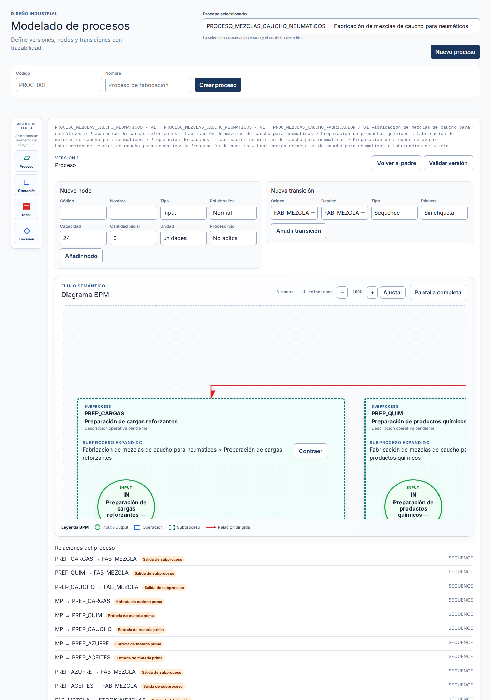

**Notas del presentador:** Presentar el proyecto como una base funcional y demostrable. Separar desde el inicio la evidencia técnica disponible de la validación humana final, que aún está pendiente.

---

## 02 · Problema & objetivo

### Del dato operativo a una explicación causal

- Reunir en un mismo espacio procesos industriales, operaciones, máquinas, contratos y árboles causales.
- Hacer visible el contexto que conecta una incidencia con su análisis.
- Mantener un recorrido reproducible mediante UI, APIs y persistencia PostgreSQL.
- Trabajar con un alcance generalista: el modelo causal y el modelado de procesos todavía tienen integración conceptual pendiente.


**Notas del presentador:** El objetivo no es prometer una integración cerrada de todos los dominios, sino mostrar una base que ya permite navegar, modelar y analizar con trazabilidad.

---

## 03 · Solución propuesta

### Una SPA que hace visible el contexto

La aplicación organiza el recorrido en vistas navegables por hash y consume APIs Flask para consultar y modificar el dominio.

**Capas verificadas**

1. Frontend estático: vistas, router, estado y componentes.
2. Flask: blueprints HTTP y punto de entrada de la SPA.
3. Servicios, casos de uso y repositorios.
4. PostgreSQL: persistencia operativa, causal y BPM.

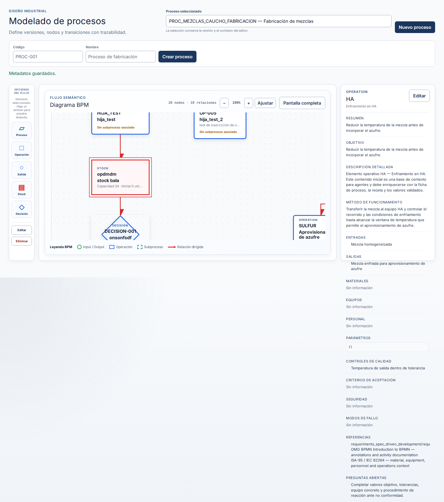

**Notas del presentador:** La captura muestra la intención de la solución: seleccionar un elemento del grafo y consultar su contexto industrial desde el propio modelado.

---

## 04 · Arquitectura & persistencia

### Separación clara de responsabilidades

```text
HTML/CSS/JavaScript
        ↓ router por hash + clientes API
Flask / blueprints HTTP
        ↓ servicios y casos de uso
Repositorios
        ↓
PostgreSQL
```

El esquema diferencia el modelo causal/operativo de las tablas de process modeling: `bpm_process`, `pm_process_node` y `pm_process_transition`.

**Decisión relevante:** cada proceso mantiene un grafo mutable; no se presenta histórico de versiones porque el README no lo confirma.

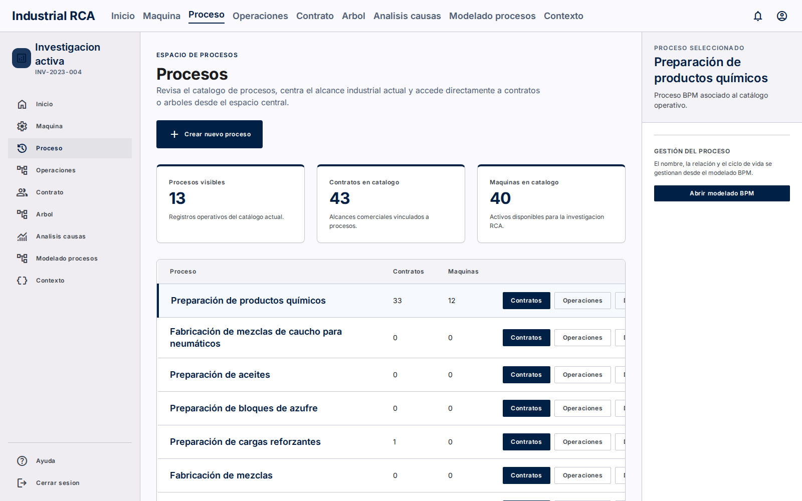

**Notas del presentador:** Aclarar que Dash queda retirado del arranque actual y que la aplicación ejecutable es la SPA servida por Flask.

---

## 05 · BPM: modelar antes de analizar

### Un grafo industrial legible y editable

El editor representa nodos de entrada, salida, operación, subproceso, decisión y stock, además de transiciones dirigidas.

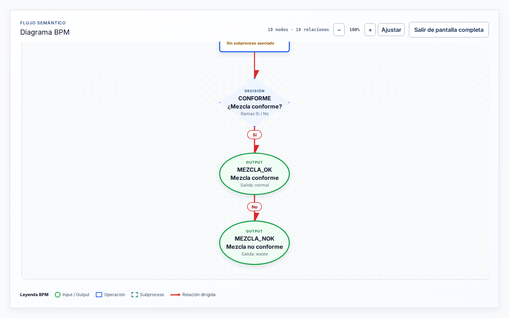

**Lectura de la captura:** una decisión separa las salidas `MEZCLA_OK` y `MEZCLA_NOK` mediante ramas etiquetadas.

**Notas del presentador:** Usar esta imagen para explicar que el proceso no es solo una lista: también expresa alternativas y condiciones visibles.

---

## 06 · Jerarquía & contexto

### Subprocesos sin perder el hilo

- Expansión inline del subproceso dentro del lienzo.
- Breadcrumb para conservar el contexto de navegación.
- Acción de contraer y relayout para volver a la vista general.
- Panel de metadatos al seleccionar un nodo.

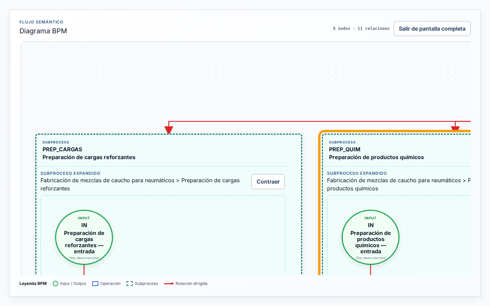

**Notas del presentador:** Destacar la navegación jerárquica y la relación entre la vista global y el detalle del proceso.

---

## 07 · Demo: seis fases reales

### Del proceso al análisis RCA

| Fase | Resultado documentado |
|---:|---|
| 1 | Proceso BPM creado desde la UI. |
| 2 | `OP-001`, `OP-002` y `OP-003` creadas mediante API Playwright porque el proceso vacío exige un nodo padre. |
| 3 | Máquina `352` creada con descripción y contrato `216`; asociaciones máquina–operación bloqueadas por `409`. |
| 4 | Contrato RCA `216` creado con KPI, objetivo y estado `review`. |
| 5 | Causa raíz e hipótesis creadas para usar el contrato como template RCA. |
| 6 | Análisis `26` importado desde la plantilla, con indicio registrado y estado `cerrado`. |

**Identificador del proceso:** `TFM_DEMO_1788104782421_PROC` · `4cda3697-8024-41ce-aaeb-a0988eff073a`

**Notas del presentador:** Esta tabla es el hilo conductor de la demo. La fase 3 debe explicarse como incompleta: no se debe presentar ninguna asociación como persistida.

---

## 08 · Evidencia del recorrido

### Seis pantallas, un mismo proceso demo

<div class="gallery">

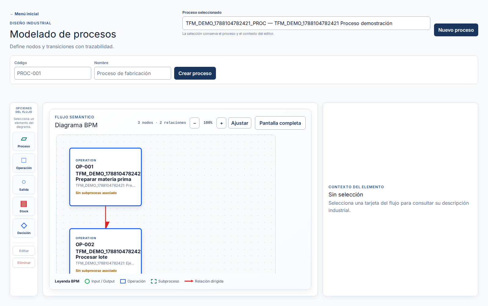
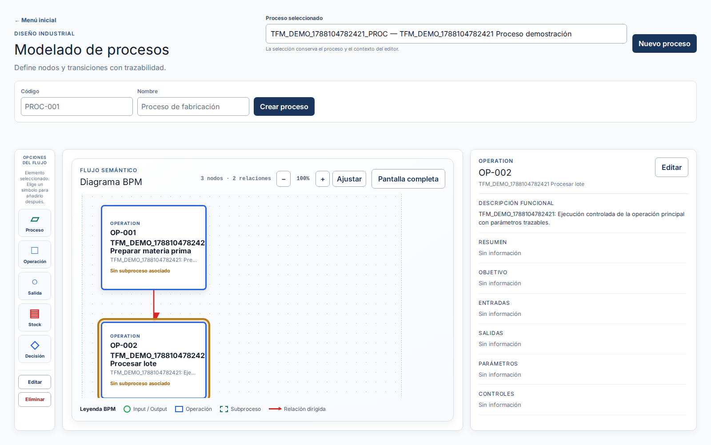
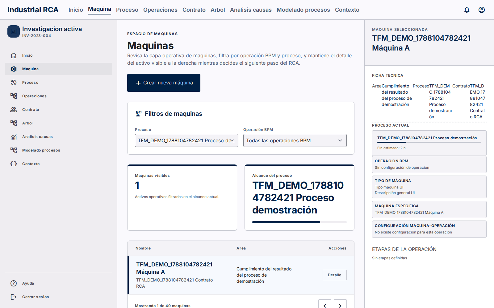
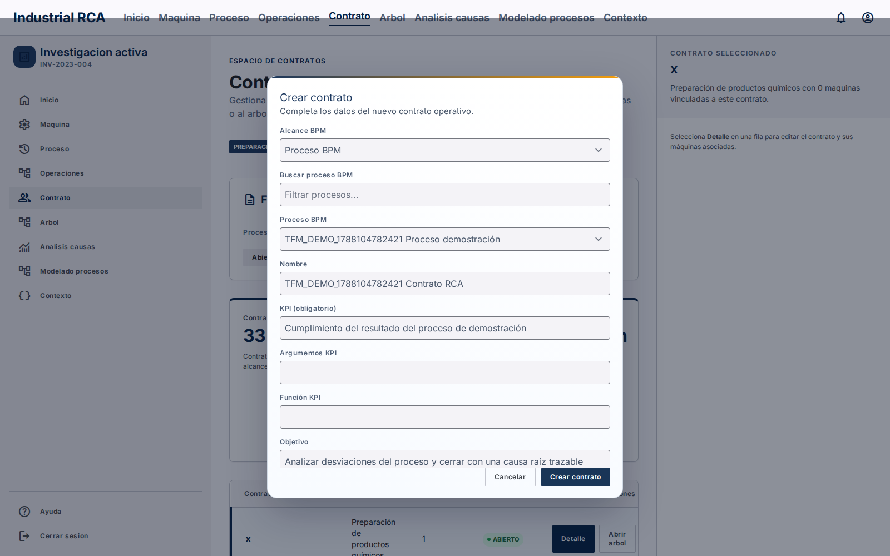
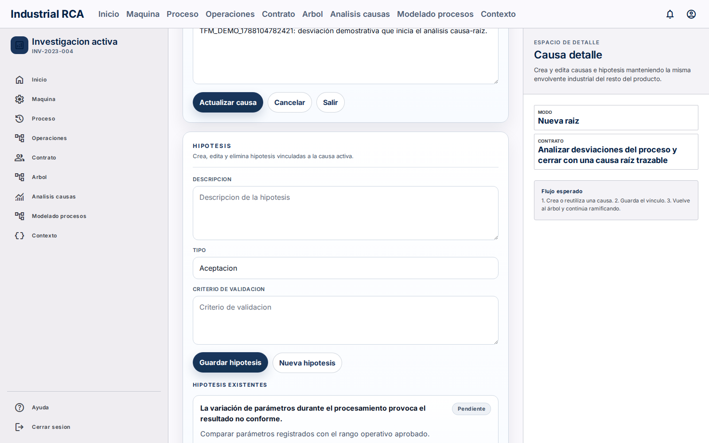
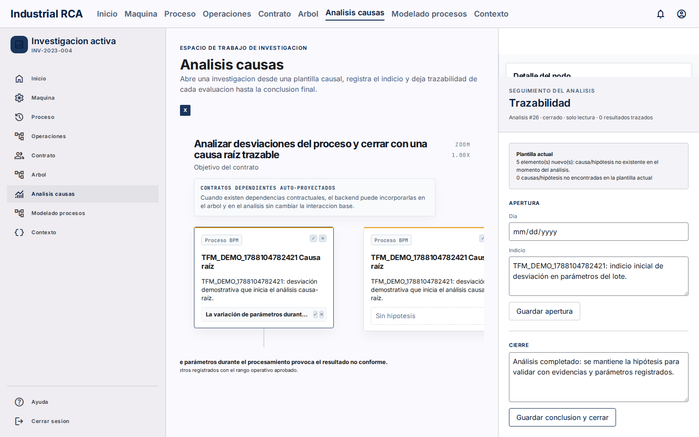

</div>

**Notas del presentador:** Recorrer las capturas de izquierda a derecha. La captura 03 es evidencia negativa: la máquina existe, pero muestra “Sin configuración de operación”.

---

## 09 · RCA: pasar del modelo a la explicación

### Un análisis trazable sobre una plantilla

El recorrido documentado enlaza:

`contrato 216` → `causa raíz` → `hipótesis 255` → `análisis 26`

El análisis se cerró con indicio y conclusión registrados en la evidencia conservada.


**Notas del presentador:** La trazabilidad se explica con los identificadores reales del flujo, sin extrapolar resultados más allá de lo que muestran las fuentes.

---

## 10 · Validación: qué está demostrado

### Evidencia técnica disponible

- Capturas Playwright tomadas contra Flask local y PostgreSQL local.
- Verificaciones documentadas sobre nodos, transiciones, expansión y ramas.
- Entidades demo comprobadas: proceso, operaciones, contrato, máquina, causas, hipótesis y análisis.
- Rutas reproducibles en la SPA: `#/modelado-procesos`, `#/maquinas`, `#/contratos`, `#/arboles` y `#/analisis_causas`.

### Estado pendiente

La validación humana final / Gate 3 sigue pendiente. El paso de pruebas técnicas no equivale al cierre del requerimiento.


**Notas del presentador:** Diferenciar “hay evidencia automatizada” de “la persona responsable ha validado la implementación para la defensa”.

---

## 11 · Limitaciones & riesgos

### Lo que debe decirse con precisión

- La asociación máquina–operación quedó bloqueada por HTTP `409 persistence_error` en las 3 configuraciones intentadas.
- Las asociaciones no se insertaron directamente ni se fabricó evidencia; quedaron no persistidas.
- El proceso vacío exigía nodo padre en la UI; por eso las operaciones se crearon mediante API Playwright.
- El modelo causal y el process modeling aún tienen integración conceptual pendiente.
- El estado final de PostgreSQL y los datos demo debe confirmarse en el entorno real de defensa.


**Notas del presentador:** Convertir el bloqueo en una conclusión honesta del trabajo de integración, no ocultarlo como si fuese una fase completada.

---

## 12 · Conclusiones

### Una base defendible, con límites visibles

1. UC_BIB_Solve ya articula contexto operativo, modelado BPM y análisis RCA en una SPA trazable.
2. El editor BPM permite representar nodos, relaciones, decisiones y subprocesos.
3. El flujo demo conserva evidencia real de seis fases y de sus entidades.
4. La máquina y el contrato se crearon, pero la asociación máquina–operación quedó pendiente por `409`.
5. La validación humana final sigue pendiente antes de declarar el requisito cerrado.


**Notas del presentador:** Cerrar con la diferencia entre capacidad implementada, evidencia disponible y trabajo pendiente. Esa separación es parte de la trazabilidad del TFM.

---

## Fuentes de trazabilidad

El relato se basa exclusivamente en `slides/guion_presentacion.md`, `slides/inventario_capturas.md`, `slides/flujo_demo.md`, `slides/fuentes.md`, `slides/documentacion.md`, `README.md` y `proyecto_master.md`, junto con las imágenes reales de `slides/capturas/`.
