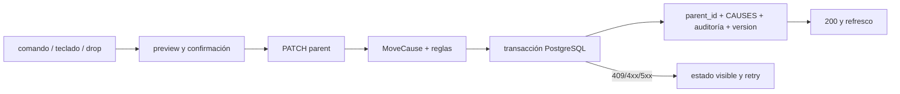

# Documentación — bounded context `RCA_TREE`

## Objetivo

`RCA_TREE` gestiona plantillas causales por contrato y las investigaciones que
se ejecutan sobre una instantánea de esas plantillas. El contexto permite
consultar y editar causas, hipótesis y resultados científicos, mover una causa
dentro de su contrato sin perder trazabilidad y representar el progreso de la
investigación como el ciclo **Definir → Medir → Analizar → Validar → Controlar**.

La autoridad de las invariantes estructurales y científicas es el backend. La
UI sólo presenta, valida interacciones y solicita operaciones mediante REST.

## Audiencia

- **Mantenedores:** necesitan conocer las fronteras de dominio, aplicación,
  persistencia, HTTP y UI antes de modificar el contexto.
- **Revisores y agentes:** necesitan los contratos de reparenting, análisis,
  compatibilidad y validación.
- **Operadores técnicos:** necesitan saber qué esquema está confirmado, qué
  verificar en operación y qué queda pendiente antes del cierre humano.

## Alcance

### Incluye

- Grafo causal por contrato, con `causa.parent_id`, relación primaria `CAUSES`
  y proyección árbol/DAG para la UI.
- CRUD de causas e hipótesis, nodos reutilizables y detalle de causa.
- Reparenting seguro con control de concurrencia optimista, auditoría y
  rollback transaccional.
- Apertura, lectura, actualización, cierre y reapertura de análisis.
- Evaluación científica compatible con payloads legacy y con campos nuevos de
  predicción, medición, evidencia, decisión y control.
- Estados de error, retry, foco/teclado y layout responsive en los adaptadores
  públicos del contexto.

### Excluye

- Automatización de decisiones científicas o cálculo de KPI sin una fuente
  acordada.
- Sustitución del renderer del grafo, migración a otro motor o rediseño de
  otras rutas BPM.
- Sincronización externa nueva: cualquier sincronización debe ser un trabajo
  separado y conservar el patrón operativo vigente.

### Relación con otros módulos

`RCA_TREE` se integra con contratos/procesos/máquinas del modelo operativo y
con la webapp pública bajo `#/arboles`, `#/causa_detalle` y
`#/analisis_causas`. El dominio no depende de Flask, PostgreSQL, Dataiku ni
JavaScript; esas dependencias entran por adaptadores.

## Estado actual

- **Responsabilidad principal:** preservar una jerarquía causal editable y una
  investigación auditable sin destruir IDs, hipótesis, resultados o
  referencias.
- **Puntos de entrada backend:** `adapters/inbound/http/routes.py`, mediante
  un Blueprint Flask creado por `create_blueprint()`.
- **Puntos de entrada frontend:** `webapp/js/api/causas.js`,
  `webapp/js/api/analysis.js` y las vistas RCA que montan árbol, detalle y
  workspace científico.
- **Capacidades actuales:** lectura del árbol/detalle, CRUD causal e hipótesis,
  reutilización de nodos, `PATCH` atómico de padre, auditoría, análisis y
  resultados científicos, cierre/reapertura y estados de error recuperables.
- **Estado de entrega:** `implementado_pendiente_validacion`. La auditoría DB
  read-only confirmó equivalencia estructural completa. El PID de validación
  `759818` terminó al cerrar la sesión; el runtime persistente actual de 8050
  es `782978` (PPID `1566`, SID `782978`), con debug desactivado. Health
  `ready/status ok` y el GET del árbol confirman `causa_id=366`,
  `parent_id=364`, `version=2`. La validación humana final y el cierre formal
  siguen pendientes; no declarar `done` desde este módulo.

## Estructura

| Ruta | Tipo | Responsabilidad | Cuándo modificar |
| --- | --- | --- | --- |
| `domain/causal_graph/entities.py` | dominio | Entidades `Node`, `Cause`, `Hypothesis` y `Relationship`. | Al cambiar invariantes o conceptos del grafo; sin SQL/UI. |
| `domain/causal_graph/rules.py` | dominio | Tipos de nodo/relación, ciclos, motivo, versión, raíces y reglas de borrado/proyección. | Al cambiar reglas funcionales; actualizar contrato y pruebas. |
| `domain/analyses/entities.py` | dominio | Estados de análisis, resultados y validación de decisiones científicas. | Al cambiar estados o requisitos de evidencia/justificación. |
| `application/use_cases/causes/move_cause.py` | aplicación | `MoveCauseCommand`, `MoveCause` y resultado del movimiento. | Al cambiar orquestación/payload; no añadir persistencia directa. |
| `application/use_cases/causes/` | aplicación | Casos de uso de creación, actualización, borrado y movimiento. | Al cambiar comportamiento funcional invocable desde adaptadores. |
| `application/use_cases/analyses/` | aplicación | Apertura, consulta, actualización y guardado de resultados. | Al cambiar el flujo del análisis; preservar compatibilidad legacy. |
| `application/ports/` | contratos | Puertos inbound/outbound para casos de uso, repositorios y transacción. | Al cambiar interfaces; adaptar infraestructura y tests. |
| `adapters/outbound/postgres/` | infraestructura | Repositorios SQL, relaciones, consultas y transacción PostgreSQL. | Al cambiar mapeo/persistencia; acompañar con migración o verificación. |
| `infrastructure/wiring.py` | composición | Inyección de repositorios y casos de uso en `RcaTreeApplication`. | Al añadir o sustituir un adaptador. |
| `adapters/inbound/http/routes.py` | entrada HTTP | Blueprint REST, payloads, actor/correlation ID y traducción de errores. | Al cambiar endpoint o contrato HTTP. |
| `webapp/js/api/causas.js` | adaptador UI | Cliente de causas, hipótesis, reparenting y nodos reutilizables. | Al cambiar rutas/payloads consumidos por la UI. |
| `webapp/js/api/analysis.js` | adaptador UI | Cliente de análisis, resultados y reapertura. | Al cambiar rutas/payloads del análisis. |
| `db_management/migrations/20260911_rca_versioning.sql` | persistencia | Versionado, campos científicos, auditoría e índices; migración aditiva. | Sólo mediante migración revisada y gate operativo. |

La dirección de dependencias es:

```text
HTTP / webapp JS
        -> application use cases
        -> domain rules, entities, ports
infrastructure / PostgreSQL adapters
        -> application ports y domain types
```

## Funcionalidad principal

| Funcionalidad | Dónde vive | Cómo se usa | Dependencias |
| --- | --- | --- | --- |
| Cargar árbol/proyección | `GetTree` + repositorios de árbol | `GET /api/rca-tree/nodes` con vista, zoom, selección y contrato. | PostgreSQL, relaciones estructurales y proyección DAG. |
| Consultar detalle | `GetCauseDetail` | `GET /api/rca-tree/causes/detail` o por ID. | Repositorios de causas/hipótesis. |
| Crear/editar/borrar causa | casos de uso de `causes/` | `POST`, `PATCH` y `DELETE /api/rca-tree/causes...`. | Reglas de raíz, referencias y repositorios. |
| Gestionar hipótesis | casos de uso de `hypotheses/` | `GET/POST` por causa, `PATCH/DELETE` por hipótesis y preview de borrado. | Entidad de hipótesis y referencias de análisis. |
| Reparenting | `MoveCause` + `CausalReparentingAdapter` + `move_cause_transaction` | `PATCH /api/rca-tree/causes/{cause_id}/parent`; comando, teclado y drop convergen en el mismo payload. | Lock PostgreSQL, versión, relación `CAUSES`, auditoría. |
| Análisis | `RcaTreeAnalysisApplication` + casos `analyses/` | `GET/POST/PATCH /api/rca-tree/analyses...` y `POST .../{id}/results`. | Snapshot del contrato, estados abierto/cerrado y persistencia de resultados. |
| Reapertura explícita | `analysis.js` + actualización de análisis | `PATCH /api/rca-tree/analyses/{id}` con `status: "abierto"`. | Transición de estado y control de sólo lectura. |

## APIs y endpoints

### Árbol, causas e hipótesis

- `GET /api/rca-tree/nodes`: devuelve la proyección del árbol/DAG.
- `GET /api/rca-tree/causes/detail` y `GET /api/rca-tree/causes/{id}`:
  detalle de causa y relaciones científicas.
- `POST /api/rca-tree/causes`: crea una causa o un nodo de contrato cuando
  `editor_mode=new_contract`.
- `PATCH /api/rca-tree/causes/{id}` y `DELETE /api/rca-tree/causes/{id}`:
  actualización y borrado sujeto a raíz, descendencia y referencias.
- `GET/POST /api/rca-tree/causes/{id}/hypotheses` y
  `PATCH/DELETE /api/rca-tree/hypotheses/{id}`: ciclo de hipótesis.
- `GET /api/rca-tree/hypotheses/{id}/delete-preview`: dependencias antes de
  borrar.
- `GET /api/rca-tree/causes/reusable/search` y
  `POST /api/rca-tree/causes/reusable/link`: búsqueda y enlace de nodos
  reutilizables.

### Movimiento de causa

```http
PATCH /api/rca-tree/causes/{cause_id}/parent
X-Correlation-ID: <opcional; se genera si falta>
Content-Type: application/json
```

```json
{
  "parent_id": 1202,
  "expected_version": 7,
  "reason": "Motivo operativo del movimiento"
}
```

`parent_id` puede ser `null` únicamente si la política de raíz del contrato lo
permite. `actor_id` se obtiene del contexto autenticado (`g.user_id`,
`g.actor_id` o `REMOTE_USER`), nunca del payload del cliente. Un `200` devuelve
causa/version, padre anterior/nuevo, descendientes afectados, relación
primaria, preservación y auditoría. Los errores llevan código, detalles y
`correlation_id`; los códigos principales son `RCA_SELF_PARENT`,
`RCA_CYCLE_DETECTED`, `RCA_CONTRACT_MISMATCH`, `RCA_ROOT_POLICY`,
`RCA_VERSION_CONFLICT`, `RCA_INVALID_REASON` y `RCA_MOVE_FAILED`.

### Análisis

- `GET /api/rca-tree/analyses`: lista análisis recientes.
- `GET /api/rca-tree/analyses/templates?process_id=...`: plantillas por
  proceso.
- `POST /api/rca-tree/analyses`: importa una plantilla y abre una investigación.
- `GET/PATCH /api/rca-tree/analyses/{analysis_id}`: lectura y actualización,
  incluida la reapertura explícita.
- `POST /api/rca-tree/analyses/{analysis_id}/results`: guarda la evaluación de
  una causa o hipótesis.

## Flujos de uso u operación

### Mover una causa

1. **Entrada:** el usuario selecciona `Mover causa…`, usa teclado o inicia un
   drop. La UI abre preview y no persiste el drop por sí solo.
2. **Preparación:** se buscan padres válidos, se excluye el subárbol, se
   muestran padre anterior/nuevo, descendientes y motivo; se envía
   `expected_version` leído del recurso.
3. **Aplicación:** HTTP construye `MoveCauseCommand`; el caso de uso carga
   contexto y vuelve a validar versión, contrato, self-parent, ciclos, raíz y
   relación primaria.
4. **Persistencia:** PostgreSQL bloquea la causa y todas las causas del
   contrato, actualiza `causa.parent_id` y `version`, reemplaza la relación
   primaria `CAUSES` e inserta auditoría dentro de una sola transacción.
5. **Salida:** sólo `200` autoriza actualizar la vista local. En `4xx/5xx` se
   conserva el nodo/formulario, se muestra código/correlación y se ofrece retry
   con versión fresca.

### Confirmación live autorizada por UI

La confirmación real de movimiento se realizó contra el backend 8050 reiniciado
durante la validación (PID de validación `759818`, terminado al cerrar la
sesión) y está documentada en
`.playwright-artifacts/rca-move-live-confirm/20260912T162739Z/`:

- `causa_02_01` (`id=366`) pasó de `parent_id=365` a `parent_id=364`
  (`causa_01`) con `PATCH 200`.
- La versión pasó de `1` a `2`; la relación primaria `CAUSES` quedó con
  `id=7052`.
- La auditoría creó el evento `id=a668...` con correlation ID `c81a...`.
- La recarga confirmó el nuevo padre y el feedback visible **Nuevo padre** fue
  **PASS**.
- El runtime persistente posterior es el PID `782978` (PPID `1566`, SID
  `782978`), comando `.venv/bin/python uc_bib_solv/local_server.py`, debug
  desactivado; health `ready/status ok` y GET del árbol confirman `id=366`,
  `parent_id=364`, `version=2`.

Esta evidencia cubre el movimiento live; el fixture científico live continúa
omitido por no existir un endpoint seguro de preparación/limpieza.



### Ciclo científico

1. **Definir:** se abre el análisis con contrato/plantilla, fecha,
   participante, máquinas e indicio de apertura.
2. **Medir:** se documentan predicción, métrica, unidad, fuente, periodo,
   método, datos, cálculo y umbral.
3. **Analizar:** se selecciona una hipótesis de la plantilla/snapshot y se
   registra evidencia observable.
4. **Validar:** una decisión `confirmada`/`rechazada`/`descartada` necesita
   evidencia y criterio; una decisión rechazada necesita justificación.
5. **Controlar:** después de decidir se registra acción/control, responsable y
   fecha. `inconclusa` requiere justificación y conserva la hipótesis.

La UI hace visibles las cinco fases, la fase actual y la siguiente acción. El
backend mantiene los estados de análisis `abierto`/`cerrado`; un análisis
cerrado es sólo lectura y únicamente una reapertura explícita vuelve a permitir
edición. Mover la plantilla no recrea el snapshot ni cambia IDs, resultados o
referencias históricas.

## Persistencia, migración y operación

### Modelo persistente relevante

- `causa.version`: token numérico de concurrencia optimista, inicialmente `1`.
- `causa.parent_id`: padre de negocio; la relación estructural PostgreSQL se
  mantiene sincronizada como `CAUSES` primaria.
- `hipotesis`: columnas científicas nullable (`prediccion`, `metrica`,
  `unidad`, `fuente_datos`, `metodo`, `periodo`, `calculo`, `umbral`).
- `analisis_resultado`: decisión, justificación, acción/control, responsable y
  fecha de control.
- `causa_movimiento_auditoria`: registro append-only con actor, contrato,
  causa, padres, versiones, motivo, correlación, resultado y timestamp UTC.
- Índices de auditoría por causa, contrato y correlación; trigger que impide
  actualizar o borrar eventos.

### Migración y arranque

`db_management/migrations/20260911_rca_versioning.sql` es aditiva e idempotente:
usa `IF EXISTS`, `IF NOT EXISTS`, columnas nullable/defaulted y recreación
controlada del check de estados. Una auditoría DB read-only confirmó en live la
equivalencia estructural completa: `causa.version`, tabla de auditoría, trigger,
índices, foreign keys y campos científicos. No existe un ledger que pruebe qué
archivo o ejecución concreta aplicó el esquema; la auditoría confirma el
resultado estructural, no la procedencia del cambio. No debe ejecutarse un
`DROP` automático.

Antes del despliegue:

1. conservar evidencia de la auditoría read-only y revisar consumidores;
2. comprobar columnas, tabla, índices, trigger append-only, foreign keys y una
   operación `TEST_` limpiable tras cada cambio futuro;
3. conservar la auditoría y hacer rollback sólo como operación manual,
   revisada y respaldada. No revertir `parent_id` automáticamente.

## Decisiones vigentes

| ID | Decisión | Racional | Alternativas consideradas | Consecuencias | Archivos afectados | Estado |
| --- | --- | --- | --- | --- | --- | --- |
| DEC-RCA-001 | Backend como autoridad de invariantes | La UI puede anticipar errores, pero contrato, ciclo, raíz, permiso y versión deben ser confiables fuera del navegador. | Validar sólo en JS. | Casos de uso y repositorios repiten validación bajo transacción. | `domain/causal_graph/rules.py`, `application/use_cases/causes/move_cause.py`, `routes.py` | Vigente |
| DEC-RCA-002 | `parent_id`, relación `CAUSES` y auditoría cambian en una transacción | Evita árboles parcialmente actualizados y conserva trazabilidad. | Actualizar causa y relación por separado; persistencia optimista en UI. | Requiere lock de las causas del contrato y rollback completo. | `transaction_postgres.py`, `causa_repo.py`, migración | Vigente |
| DEC-RCA-003 | `expected_version` es token de causa, no versión de workflow | Detecta carreras sin inventar versionado de procesos o análisis. | Comparar sólo timestamps o aceptar último escritor. | Un retry debe leer la versión actual y volver a confirmar. | contrato, dominio, persistencia, API | Vigente |
| DEC-RCA-004 | Comando explícito es la operación base; drop sólo acelera | El mismo preview/payload reduce divergencias y hace accesible el movimiento. | Persistir directamente al soltar. | El drop nunca muta por sí solo; teclado y comando tienen el mismo contrato. | APIs y componentes/vistas RCA | Vigente |
| DEC-RCA-005 | Snapshot de análisis separado de plantilla editable | Una investigación debe conservar el contexto histórico aunque se reparenten causas después. | Releer siempre la plantilla viva. | Se preservan IDs, resultados y referencias; comparar plantilla es explícito. | entidades de análisis, repositorios, vistas | Vigente |
| DEC-RCA-006 | Compatibilidad aditiva con campos científicos nullable | Permite leer/escribir payloads legacy sin backfill inventado ni reescritura destructiva. | Obligar migración de todos los registros existentes. | La UI guía campos vacíos y el dominio exige evidencia sólo al decidir. | migración, entidades, casos de uso de análisis | Vigente |
| DEC-RCA-007 | Auditoría append-only y compensación explícita | El historial es evidencia; borrar o mutar eventos ocultaría decisiones. | Undo destructivo o UPDATE del evento anterior. | Un cambio correctivo es otro movimiento auditado. | migración y persistencia de movimiento | Vigente |

## Invariantes y riesgos

### Invariantes que no deben romperse

- Una causa y su padre pertenecen al mismo contrato.
- Una causa no puede ser su propio padre ni quedar bajo un descendiente.
- La raíz inicial protegida no se convierte en hija; el contrato no admite
  segunda raíz.
- Sólo existe una relación primaria `CAUSES` para la causa movida.
- `expected_version` coincide bajo lock; si no, no se escribe.
- Un movimiento no cambia IDs, `hypothesis.cause_id`, resultados,
  referencias ni snapshots.
- Un análisis cerrado no se modifica; reabrir es explícito y auditable.
- Decisiones finales requieren criterio y evidencia; `inconclusa` requiere
  justificación.
- Un error HTTP no se presenta como éxito ni elimina optimistamente el nodo.

### Riesgos y mitigaciones

- **DAG proyectado confundido con árbol editable:** distinguir nodos
  reutilizados y limitar el movimiento al contrato; no mutar enlaces secundarios.
- **Carreras concurrentes:** lock de todas las causas del contrato y versión
  compare-and-update.
- **Procedencia del esquema:** la equivalencia live está confirmada, pero no
  hay ledger de qué archivo o ejecución aplicó la migración; conservar la
  auditoría y repetir comprobaciones read-only tras cambios de despliegue.
- **Rollback destructivo:** backup y revisión humana; dejar columnas/tablas
  nuevas inertes es preferible a eliminar auditoría válida.
- **Cobertura de accesibilidad incompleta:** la evidencia actual cubre DOM,
  foco y responsive; axe/Lighthouse y lector de pantalla aún no están
  ejecutados.
- **Fixture científico live omitido:** el movimiento live ya está confirmado;
  sólo el fixture científico sigue omitido por falta de un endpoint seguro de
  preparación y limpieza.

## Validación y troubleshooting

| Comprobación | Comando / método | Resultado esperado | Si falla |
| --- | --- | --- | --- |
| Reglas y persistencia RCA | `PYTHONPATH=. ./.venv/bin/pytest ...` (matriz RCA autorizada) | 24 tests Python y 9 subtests pasados. | Revisar invariantes, puertos y transacción. |
| Contratos frontend RCA | `node --test ...` (matriz RCA autorizada) | 16 tests pasados. | Revisar payload/rutas y no relajar el contrato para ocultar un error. |
| Arquitectura | Controles de límites y subtests de la matriz NC-013 | 9 subtests pasados. | Corregir dependencias de capa antes de integrar. |
| HTTP de movimiento | Enviar `PATCH` con fixture `TEST_`, `expected_version` actual y `reason`; repetir con self-parent, descendiente y versión obsoleta. | `200` sólo para movimiento válido; `409/422` sin cambios de tablas y con `correlation_id`. | Revisar `routes.py`, `MoveCause` y lock/transacción. |
| Error/retry UI | Simular 409/500/503 en la instancia aislada y verificar estado visible, formulario conservado y retry. | No se afirma éxito ni se pierde selección. | Revisar `requestJson`, estados locales y manejo de errores. |
| Auditoría de esquema live | Consulta read-only de `causa.version`, auditoría, trigger, índices, FK y campos científicos. | Equivalencia estructural confirmada; no se presume procedencia sin ledger. | Detener cambios destructivos y repetir auditoría antes del cierre. |
| Higiene | `git diff --check` y búsqueda de `print`, `debugger`, `console.log`, `FIXME`. | Sin errores de whitespace ni debug de producción. | Corregir antes del gate humano final. |

## Artefactos de referencia

- **Plan no-SDD:** [`plan.md`](../../../plan.md), especialmente arquitectura,
  T00–T14, trazabilidad, gates y estado `implementado_pendiente_validacion`.
- **Contrato funcional/técnico:** [`docs/rca-reparenting-contract.md`](../../../docs/rca-reparenting-contract.md).
- **Contexto funcional:** [`docs/ui-arbol-analisis-functional-context.md`](../../../docs/ui-arbol-analisis-functional-context.md).
- **Handoff de implementación:** [`docs/rca-implementation-report.md`](../../../docs/rca-implementation-report.md).
- **Migración:** [`db_management/migrations/20260911_rca_versioning.sql`](../../../db_management/migrations/20260911_rca_versioning.sql).
- **`spec.md`/`task_plan.md`:** no existen ni participan en este flujo no-SDD;
  `plan.md` fue solicitado explícitamente como artefacto de coordinación.
- **`context.md`:** no se modifica en esta fase; su mantenimiento corresponde
  a `context-agent` si se solicita.
- **No conformidades:** consultar el registro UI/NC y la revisión visual T13;
  el cierre formal de NCs y la validación humana no están implícitos en esta
  documentación.
